# Design Document: Walrus-Native ZK Login Architecture

## Overview

This design transforms Swrap from a proof-of-concept with server-side decryption helpers into a Walrus-native, privacy-first form platform with Web2-grade UX. The architecture rests on four convictions:

1. **Walrus is canonical.** Form schemas, submissions, encrypted payloads, and file attachments live as Walrus blobs. Postgres stores only metadata, indexes, and audit records.
2. **The browser is the only place plaintext exists for private forms.** Encryption with Seal happens client-side, before bytes leave the device. The API server cannot decrypt.
3. **Identity is invisible.** Google + Sui ZK Login produces an ephemeral, browser-only signer that doubles as the Seal authority and the form/submission owner. External wallets are an advanced fallback, never a requirement.
4. **The UX hides the chain.** Users see "Private", "Protected", "Shared", "Secure". Blob IDs, transaction hashes, and policy IDs only surface when an advanced view is toggled on.

The work is **incremental**, not a rewrite. The existing `apps/api` Express service and `apps/web` Next.js app coexist throughout. Migration steps consolidate duplicated POC modules into single canonical modules per concern (auth, Seal client, metadata API client, upload handler). Legacy bypass-auth flags, POC decryption routes, and infrastructure private keys are removed in the cleanup pass and gated by startup-time legacy detection.

The deployment target is a 2 GB DigitalOcean Ubuntu droplet running a Docker Compose stack of `web`, `api`, `postgres`, and `nginx` with a combined memory budget under 1.6 GB so that OS overhead fits comfortably.

### Goals

- Replace server-side decryption with client-side Seal encryption bound to a Seal policy that authorizes the form owner.
- Treat Walrus as the source of truth for content; treat Postgres as a search/index plane.
- Make Google sign-in the default; preserve external wallets as an advanced path.
- Provide a deterministic Upload State Machine with retries, browser persistence, and orphan reconciliation.
- Harden the API to orchestration + metadata only, with a typed envelope, structured logs, payload limits, rate limiting, env validation, CORS, security headers, and startup-time legacy detection.
- Deploy reliably on a 2 GB VPS via Docker Compose behind Nginx with TLS termination.
- Cleanup the codebase to one auth module, one Seal client module, one metadata API client module, one upload handler.

### Non-Goals (Out of Scope)

- Multi-tenant organization features, role-based access control beyond owner == signer.
- Cross-form analytics, aggregation, or differential privacy.
- Mobile-native applications. The Web App targets responsive web.
- Mainnet deployment. The architecture is mainnet-ready, but the migration target is testnet.
- Server-side decryption for any reason, including admin recovery.
- Dynamic Seal policy mutation post-creation (privacy mode change creates a new form version).
- Federation across multiple Walrus aggregators or sharded Postgres.

### Glossary

The terms used throughout this document follow `requirements.md` (Swrap, Web_App, API_Server, Postgres_Store, Walrus_Store, Seal_Service, Seal_Signer, Seal_Policy, ZK_Login_Account, External_Wallet, Form_Owner, Public_Form, Private_Form, Submission_Payload, Submission_Record, Upload_Job, Upload_State_Machine, Trust_Boundary, UX_Vocabulary, Bypass_Auth, POC_Decrypt_Route, Infra_Wallet_Privkey, Env_Validator, Rate_Limiter, Payload_Limit, Health_Check, VPS_Host).

---

## Architecture

### High-Level Component Diagram

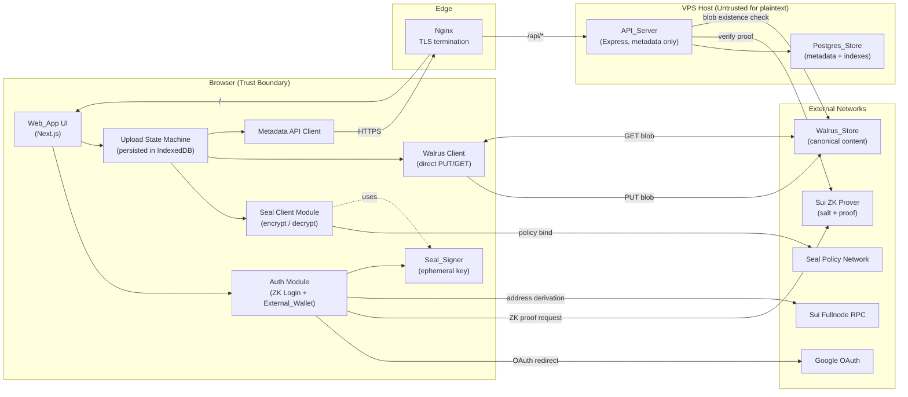

### Trust Boundary Diagram

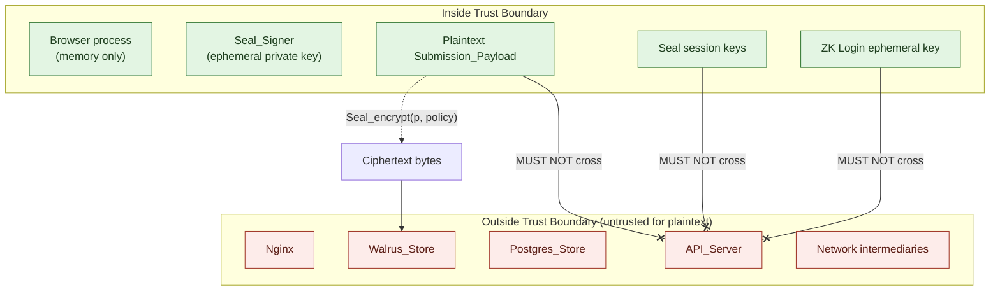

The boundary is a runtime invariant. `Plaintext_Submission_Payload`, `Seal_session_key`, and `ZK_Login_ephemeral_private_key` MUST NOT cross from inside to outside. Crossings are detected by:

- Architectural lints (forbid imports of `seal-client` into `apps/api`).
- Telemetry allow-list (only blob IDs, state names, request IDs, asserted addresses).
- Property-based tests that scan API request bodies for plaintext substrings during a synthetic upload pipeline.

### Layering and Module Map

| Layer | Module | Responsibility |
|---|---|---|
| `apps/web/lib/auth` | `auth-client` | Single auth module: ZK Login + External_Wallet, ephemeral key lifecycle, session model. |
| `apps/web/lib/seal` | `seal-client` | Single Seal client: encrypt, decrypt, policy bind, key zeroization. |
| `apps/web/lib/walrus` | `walrus-client` | Direct Walrus PUT/GET with backoff, integrity verification. |
| `apps/web/lib/api` | `metadata-client` | Single typed API client for metadata orchestration. |
| `apps/web/lib/upload` | `upload-state-machine` | Upload_Job lifecycle, retries, IndexedDB persistence, orphan detection. |
| `apps/web/lib/copy` | `ux-copy` | UX_Vocabulary mapping (Private / Protected / Shared / Secure / phase names). |
| `apps/api/auth` | `zk-verify`, `signer-bind` | ZK proof verification, address binding. |
| `apps/api/middleware` | `env-validator`, `rate-limit`, `cors`, `security-headers`, `request-logger`, `error-handler`, `payload-limit`, `legacy-detector` | Cross-cutting middleware. |
| `apps/api/routes` | `forms`, `submissions`, `files`, `users`, `upload-jobs`, `health` | Metadata-only HTTP routes. |
| `apps/api/services` | `metadata-orchestrator`, `walrus-existence-check` | Orchestration of metadata writes; verifies blob exists on Walrus before `indexed`. |
| `db/migrations` | versioned SQL | Postgres schema migrations (see Data Models). |

---

## Components and Interfaces

### 1. Authentication Architecture

#### Sign-in Flows

The Web_App offers two coexisting paths. The active signer is whichever one the user most recently authenticated. Either acts as Seal_Signer and Form_Owner.

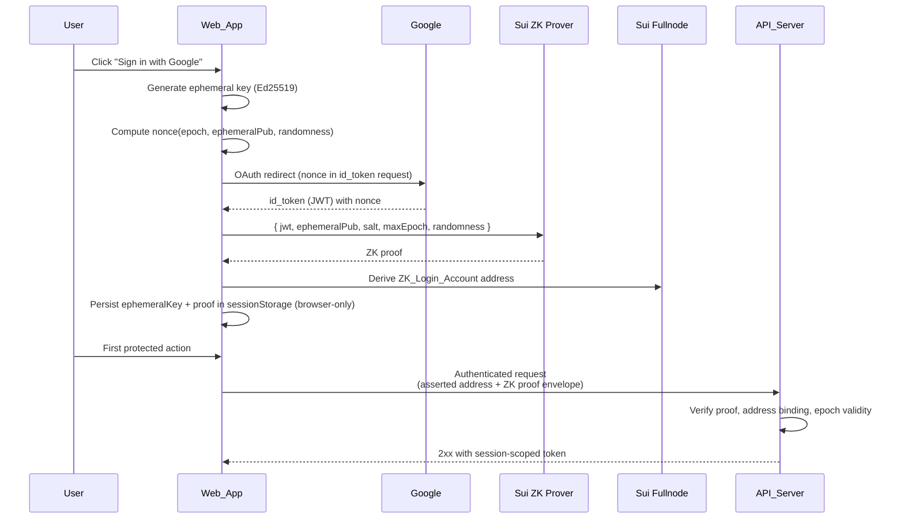

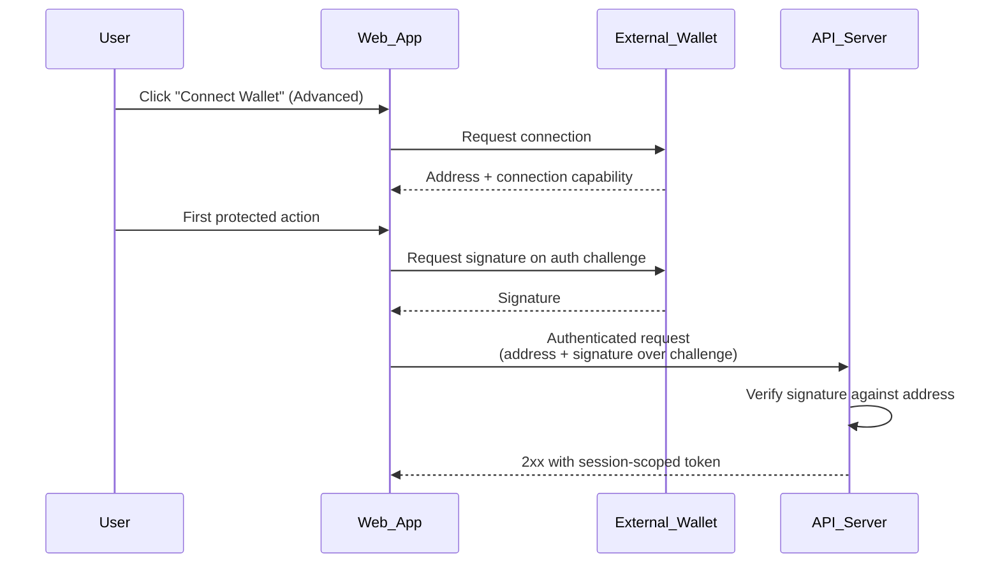

#### Ephemeral Key Lifecycle (ZK Login)

| Phase | Storage | Notes |
|---|---|---|
| Generated | `sessionStorage` keyed by session id | Survives reload within tab; cleared on tab close. **Never** `localStorage`. **Never** sent to API. |
| Active | In-memory `CryptoKey` for signing | Re-derived from sessionStorage on reload. |
| Expired | `maxEpoch` reached → cleared | Web_App prompts re-auth; pending Upload_Jobs in `pending`/`encrypting` are paused with a `requires_reauth` indicator. |
| Logged out | Both sessionStorage + memory cleared | Triggers `auth-client.zeroizeEphemeral()`. |

The ephemeral key, the JWT, the salt, and the proof are **session secrets**. They never leave the browser. The API only receives the **address + proof envelope** that the prover network can validate.

#### Session Model

- **Server session token**: opaque, HttpOnly cookie + `Authorization: Bearer` for API calls. Issued only after `zk-verify` (or wallet signature) succeeds. Tied to the asserted address. Rate-limited per address.
- **Client session state**: `auth-client` exposes a single `useSession()` hook returning `{ status, address, signerKind, expiresAt }`. `signerKind` is `"zk-login" | "external-wallet"`.
- **Re-auth triggers**: epoch expiry (ZK), explicit logout, signature challenge revocation.

#### Server-Side ZK Proof Verification

`apps/api/auth/zk-verify.ts` exposes `verifyZkProof(envelope) → { valid, address }`. It checks:

1. JWT signature against Google's JWKs (cached, refreshed by validity window).
2. Nonce binding: nonce derived from `(epoch, ephemeralPub, randomness)` matches JWT claim.
3. ZK proof validity against Sui's verifier (uses `@mysten/zklogin` server bindings).
4. `maxEpoch ≥ currentEpoch` from Sui RPC.
5. Address derivation from `(jwt.iss, jwt.sub, jwt.aud, salt_hash)` matches the asserted address.

A single-bit mutation of any field MUST cause `valid = false`. This is enforced by Property 2 (see Correctness Properties).

#### What the Server Never Sees

- Ephemeral private key.
- Raw JWT (only the proof envelope and asserted address; the JWT itself stays in the browser).
- ZK randomness or salt.

### 2. Client-Side Seal Encryption

The Seal client is the **only** module in the Web_App that touches plaintext for Private_Forms past the form-fill UI buffer.

#### Encryption Pipeline

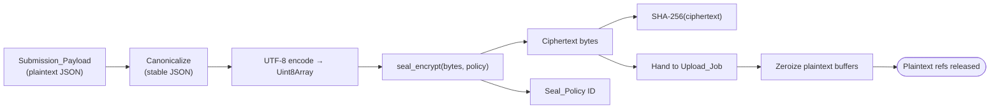

`seal-client.encrypt(payload, formOwnerAddress) → { ciphertext, policyId, digest, scheme }`:

1. Canonicalize the JSON payload deterministically (sorted keys, no whitespace) so re-encryption produces stable digests over equal inputs.
2. UTF-8 encode into a `Uint8Array`.
3. Call Seal SDK to encrypt against a freshly derived `Seal_Policy` whose authorized signer set is `{ formOwnerAddress }`. (Future: `{ formOwnerAddress, ...sharedAddresses }`, not in scope.)
4. Compute SHA-256 over the ciphertext bytes (digest is stored in metadata for integrity checks).
5. Wipe plaintext buffers: overwrite the underlying `ArrayBuffer` with zeros, drop references, drop the canonicalized string.
6. Return `{ ciphertext, policyId, digest, scheme }` where `scheme` records the Seal version and key-derivation parameters.

#### Seal_Policy Binding

A Seal_Policy authorizes one or more Sui addresses to decrypt a ciphertext. For Private_Forms:

- The policy authorizes **the Form_Owner address only** (== current Seal_Signer at form creation).
- The policy ID is recorded in the form's metadata and on each submission's metadata row. Submissions inherit the form's policy.
- A privacy mode change creates a **new Form_Definition version** with a new policy. Prior submissions are immutable.

#### Plaintext Zeroization

The `seal-client.encrypt` contract:

- Plaintext reference is held only inside `seal-client.encrypt` for the duration of the call.
- Before returning, the function calls `zeroize(buffer)` which overwrites every byte with `0` and drops the local reference.
- The form-fill UI hands the payload via a transferable buffer where supported, so the UI's reference is severed at function entry.
- An automated test asserts: after `encrypt` resolves, scanning the heap for the original plaintext substring yields no matches *within the seal-client module's reachable graph*. (See Trust Boundary Tests under Testing Strategy.)

#### Decryption Authorization

`seal-client.decrypt(ciphertext, policyId) → plaintext`:

1. Pre-check: ask the Seal policy network whether the **active Seal_Signer address** is in the policy's authorized set.
2. If not: throw `UnauthorizedSignerError` **before** issuing any decryption request. Requirement 2.5 forbids issuing the request at all.
3. If yes: request decryption keys, decrypt, return plaintext.
4. The API_Server is **never** in this loop. There is no decryption endpoint on the API.

### 3. Walrus-Native Storage Flow

The Web_App writes directly to Walrus via the configured publisher and reads via the configured aggregator. The API_Server is not in the data path for content; it only verifies blob existence before transitioning records to `indexed`.

#### Upload Sequence (Public Form)

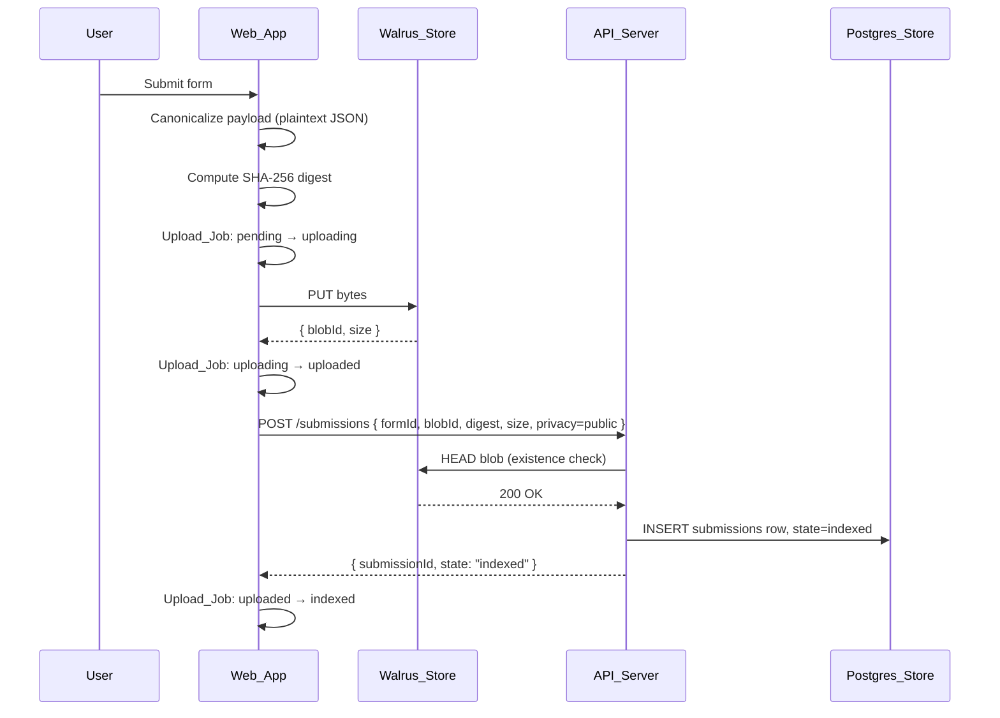

#### Upload Sequence (Private Form)

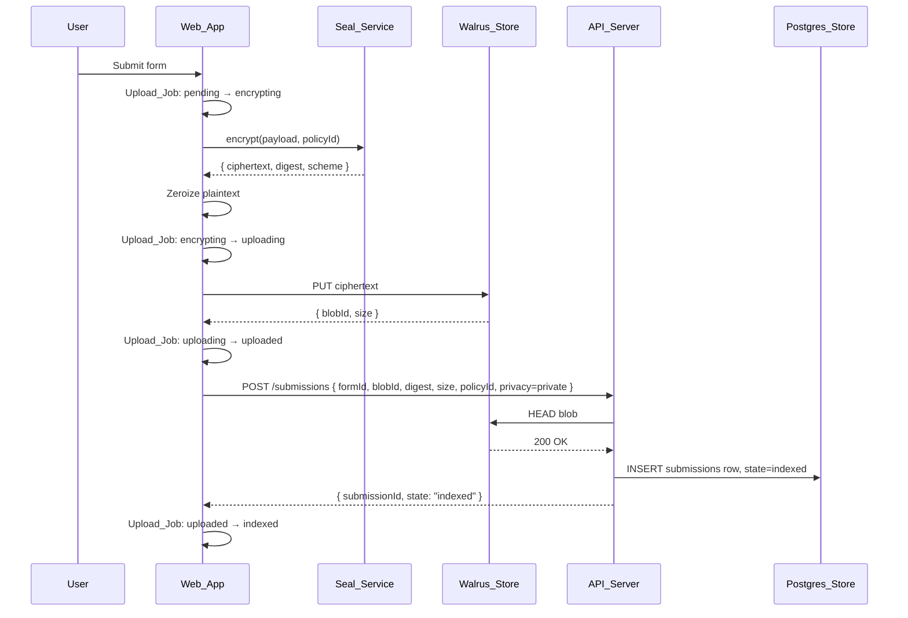

#### Retrieval Sequence

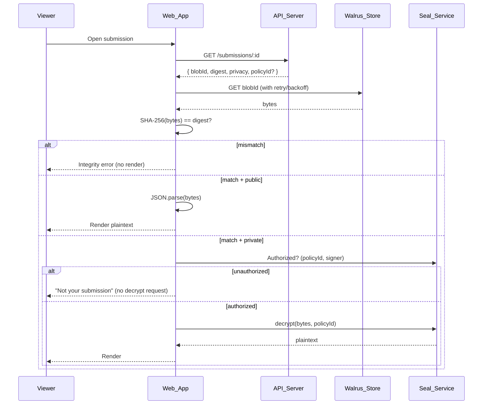

#### Retry/Backoff Strategy

`walrus-client.fetch(blobId)`:

- Attempts: configurable, default 5.
- Backoff: exponential with jitter — `min(2^n * 100ms + rand(0..100ms), 10s)`.
- Retryable: network errors, 5xx, 429.
- Non-retryable: 404, integrity-digest mismatch (returned to caller immediately as `IntegrityError`).
- After exhaustion: `WalrusFetchError` with attempt log, surfaced to the user with a "Retry" affordance.

#### Orphan Handling

An **orphan** is a blob that reached `uploaded` (Walrus has it) but never reached `indexed` (no metadata row). Causes: API call failed, browser closed mid-flight, network partition during indexing.

- The Web_App persists every Upload_Job to IndexedDB. On reload, `upload-state-machine.resume()` walks all jobs.
- For any job in `uploaded` for longer than `ORPHAN_TIMEOUT_MS` (default 5 minutes), the UI surfaces a **Reconcile** affordance:
  - **Reconcile**: retry the metadata write (idempotent on `(formId, blobId)` unique constraint).
  - **Discard**: mark the job `failed` locally; the blob remains on Walrus but unreferenced. (Walrus blobs are immutable and have their own retention; we do not attempt deletion.)
- The API_Server does not actively GC orphans. It is the client's responsibility to reconcile, because the client owns the state machine. A future operator job may sweep stale upload_jobs, out of scope here.

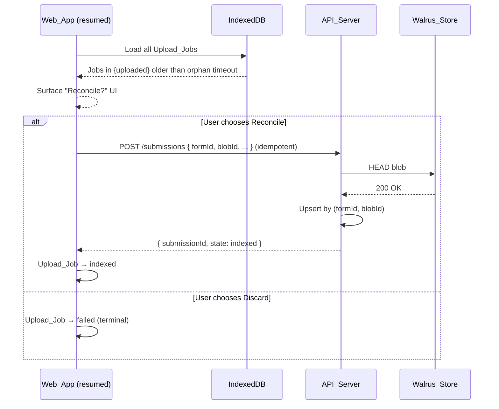

### 4. Form Privacy Architecture

#### Mode Selection

At form creation, the Form_Owner picks **Private** (Seal-encrypted) or **Public** (plaintext JSON). The choice is stored in `forms.privacy_mode` and in the Form_Definition's body on Walrus. Subsequent submissions branch deterministically on this value:

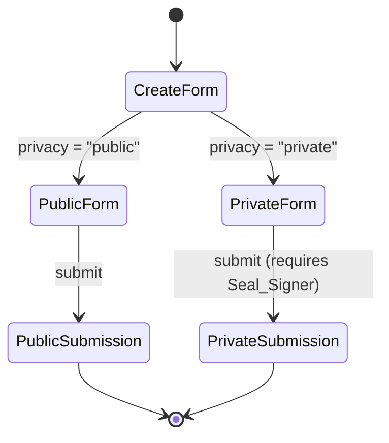

#### Enforcement

- **Client**: `metadata-client.createSubmission` reads `form.privacyMode` and routes through plaintext or Seal pipeline. The branch is not negotiable.
- **Server**: `submissions` create handler rejects mismatches: if request body declares `privacy=public` but `forms.privacy_mode = private`, return 400 `PrivacyModeMismatch`.
- **No decrypted plaintext network transit** for Private_Forms: enforced by the Seal client (encrypts before any network call) and by trust boundary lints (no `walrus-client` import inside `seal-client.encrypt`'s plaintext scope).

#### Versioning on Privacy Change

A privacy mode change is a **new form version**, never a mutation of an existing form. The `forms` table carries a `version` column; submissions reference `(form_id, form_version)`. Prior submissions remain decryptable under their original policy.

### 5. Postgres Metadata Schema

Postgres holds metadata, indexes, audit, and idempotency keys. **No payload bodies.** **No ciphertext.** **No file bytes.** **No private keys.**

#### Tables

```sql
-- users: one row per known signer address (created lazily on first auth)
CREATE TABLE users (
  address                TEXT PRIMARY KEY,             -- Sui address (0x-prefixed)
  signer_kind            TEXT NOT NULL CHECK (signer_kind IN ('zk-login','external-wallet')),
  display_name           TEXT,                          -- optional, user-set
  created_at             TIMESTAMPTZ NOT NULL DEFAULT now(),
  last_seen_at           TIMESTAMPTZ NOT NULL DEFAULT now()
);

-- forms: metadata row per Form_Definition version
CREATE TABLE forms (
  id                     UUID PRIMARY KEY,
  owner_address          TEXT NOT NULL REFERENCES users(address),
  walrus_blob_id         TEXT NOT NULL UNIQUE,         -- canonical Form_Definition blob
  privacy_mode           TEXT NOT NULL CHECK (privacy_mode IN ('public','private')),
  policy_id              TEXT,                          -- Seal_Policy ID, NULL for public
  version                INTEGER NOT NULL DEFAULT 1,
  predecessor_id         UUID REFERENCES forms(id),     -- prior version on privacy change
  state                  TEXT NOT NULL CHECK (state IN ('pending','encrypting','uploading','uploaded','indexed','failed')),
  created_at             TIMESTAMPTZ NOT NULL DEFAULT now(),
  CHECK (privacy_mode = 'public' OR policy_id IS NOT NULL)
);
CREATE INDEX forms_owner_idx ON forms(owner_address);
CREATE INDEX forms_state_idx ON forms(state);

-- submissions: metadata row per Submission_Payload
CREATE TABLE submissions (
  id                     UUID PRIMARY KEY,
  form_id                UUID NOT NULL REFERENCES forms(id),
  form_version           INTEGER NOT NULL,
  submitter_address      TEXT NOT NULL REFERENCES users(address),
  walrus_blob_id         TEXT NOT NULL UNIQUE,
  privacy_mode           TEXT NOT NULL CHECK (privacy_mode IN ('public','private')),
  content_digest         TEXT NOT NULL,                 -- SHA-256(bytes), hex
  size_bytes             BIGINT NOT NULL CHECK (size_bytes >= 0),
  state                  TEXT NOT NULL CHECK (state IN ('pending','encrypting','uploading','uploaded','indexed','failed')),
  created_at             TIMESTAMPTZ NOT NULL DEFAULT now(),
  UNIQUE (form_id, walrus_blob_id)                       -- supports idempotent reconcile
);
CREATE INDEX submissions_form_idx     ON submissions(form_id);
CREATE INDEX submissions_owner_idx    ON submissions(submitter_address);
CREATE INDEX submissions_state_idx    ON submissions(state);

-- files: metadata for file attachments under a submission
CREATE TABLE files (
  id                     UUID PRIMARY KEY,
  submission_id          UUID NOT NULL REFERENCES submissions(id),
  walrus_blob_id         TEXT NOT NULL UNIQUE,
  content_type           TEXT NOT NULL,
  size_bytes             BIGINT NOT NULL CHECK (size_bytes >= 0),
  content_digest         TEXT NOT NULL,
  state                  TEXT NOT NULL CHECK (state IN ('pending','encrypting','uploading','uploaded','indexed','failed')),
  created_at             TIMESTAMPTZ NOT NULL DEFAULT now()
);
CREATE INDEX files_submission_idx ON files(submission_id);
CREATE INDEX files_state_idx      ON files(state);

-- upload_jobs: server-visible reflection of client Upload_Job (used for reconciliation/audit)
CREATE TABLE upload_jobs (
  id                     UUID PRIMARY KEY,
  owner_address          TEXT NOT NULL REFERENCES users(address),
  artifact_kind          TEXT NOT NULL CHECK (artifact_kind IN ('form','submission','file')),
  artifact_id            UUID,                           -- NULL until indexed
  walrus_blob_id         TEXT,                           -- NULL until uploaded
  state                  TEXT NOT NULL CHECK (state IN ('pending','encrypting','uploading','uploaded','indexed','failed')),
  failure_reason         TEXT,
  created_at             TIMESTAMPTZ NOT NULL DEFAULT now(),
  updated_at             TIMESTAMPTZ NOT NULL DEFAULT now(),
  UNIQUE (owner_address, walrus_blob_id)                  -- idempotent on retry
);
CREATE INDEX upload_jobs_state_idx ON upload_jobs(state);
CREATE INDEX upload_jobs_owner_idx ON upload_jobs(owner_address);

-- activity: append-only audit
CREATE TABLE activity (
  id                     BIGSERIAL PRIMARY KEY,
  request_id             TEXT NOT NULL,
  actor_address          TEXT,
  action                 TEXT NOT NULL,                 -- e.g., "submission.create"
  target_kind            TEXT,
  target_id              UUID,
  outcome                TEXT NOT NULL CHECK (outcome IN ('ok','denied','error')),
  http_status            INTEGER,
  created_at             TIMESTAMPTZ NOT NULL DEFAULT now()
);
CREATE INDEX activity_actor_idx   ON activity(actor_address);
CREATE INDEX activity_action_idx  ON activity(action);
CREATE INDEX activity_created_idx ON activity(created_at DESC);

-- permissions: forward-compat for shared/protected modes (currently owner-only enforced)
CREATE TABLE permissions (
  id                     UUID PRIMARY KEY,
  form_id                UUID NOT NULL REFERENCES forms(id),
  grantee_address        TEXT NOT NULL REFERENCES users(address),
  capability             TEXT NOT NULL CHECK (capability IN ('view','submit','manage')),
  granted_by_address     TEXT NOT NULL REFERENCES users(address),
  created_at             TIMESTAMPTZ NOT NULL DEFAULT now(),
  UNIQUE (form_id, grantee_address, capability)
);
```

#### Migration Tool

Migrations are managed by **`node-pg-migrate`** (chosen for plain SQL, ESM-friendly, small footprint). Migration files live at `db/migrations/NNNN_<name>.sql`, are committed to the repository, and run via `pnpm migrate up` in CI and at deploy time. The migration history table is `pgmigrations`.

#### What Postgres MUST NOT contain

| Forbidden | Enforcement |
|---|---|
| Form_Definition body | No `bytea`/`jsonb_body` columns; only `walrus_blob_id`. |
| Submission_Payload body | Same; `content_digest` and `size_bytes` only. |
| Plaintext form fields | No per-field columns; the schema is in the Walrus blob. |
| Ciphertext bodies | Same; only digest. |
| File bytes | Only `walrus_blob_id`, `content_type`, `size_bytes`, `content_digest`. |
| ZK ephemeral keys / Seal session keys | Not modeled in any column. |

A schema lint (`db/lint/forbidden-columns.sql`) runs in CI and asserts no column type is `bytea`/`jsonb`/`text` with a name suggestive of payload (`body`, `plaintext`, `cipher`, `private_key`).

### 6. Upload State Machine

```mermaid
stateDiagram-v2
  [*] --> pending
  pending --> encrypting: privacy = private
  pending --> uploading: privacy = public
  encrypting --> uploading: encrypt ok
  encrypting --> failed: encrypt error
  uploading --> uploaded: walrus put ok
  uploading --> failed: walrus put error
  uploaded --> indexed: api confirm ok
  uploaded --> failed: api validation error
  uploaded --> uploaded: orphan timeout (no transition; UI flags reconcile)
  failed --> pending: retry from earliest non-completed step
  indexed --> [*]
```

#### State Reference

| State | Meaning | Allowed next | UX phrase |
|---|---|---|---|
| `pending` | Job created, no work started | `encrypting`, `uploading`, `failed` | "Preparing" |
| `encrypting` | Seal encryption in progress (private only) | `uploading`, `failed` | "Securing" |
| `uploading` | Walrus PUT in progress | `uploaded`, `failed` | "Uploading" |
| `uploaded` | Walrus confirmed, awaiting metadata | `indexed`, `failed` (if orphan timeout exceeded the user may also reconcile) | "Saving" |
| `indexed` | Metadata row exists (terminal success) | — | "Saved" |
| `failed` | Recoverable error | `pending` (on retry) | "Couldn't save — retry" |

**Retry**: from `failed`, the client recomputes the earliest step still needed. If we have a blob ID but no submission record, retry **only** the metadata write. If we have ciphertext but no blob, retry the upload. If we have plaintext but no ciphertext, restart from `encrypting`. Retry transitions are **idempotent**: retrying twice from the same recovery point yields the same final state.

**Orphan timeout** is observed inside the `uploaded` state. It does not transition the state machine on its own; the UI surfaces a reconcile affordance. The job stays in `uploaded` until the user reconciles (→ `indexed`) or discards (→ `failed`).

#### Browser Persistence

`upload-state-machine` persists every job to **IndexedDB** at every transition. The schema is:

```ts
interface UploadJobRecord {
  id: string;
  artifactKind: 'form' | 'submission' | 'file';
  formId?: string;
  privacyMode: 'public' | 'private';
  state: UploadState;
  ciphertextHandle?: string;     // opaque ref to blob in IndexedDB; ciphertext only, never plaintext
  blobId?: string;
  digest?: string;
  size?: number;
  policyId?: string;
  failureReason?: string;
  createdAt: number;
  updatedAt: number;
}
```

The plaintext payload is **never** persisted to IndexedDB. Ciphertext is persisted only between `encrypting`/`uploading` so an interrupted upload can resume without re-encrypting. Once `uploaded` is reached, the ciphertext is dropped from IndexedDB.

#### UX Vocab Mapping

`ux-copy.uploadPhase(state) → string` is the only place state names cross into UI strings.

### 7. API Refactor: Endpoints, Envelope, Authorization, Logging

#### Endpoint Catalog

All routes are JSON-only. None accept content bytes, ciphertext, or plaintext fields.

| Method | Path | Purpose | Auth |
|---|---|---|---|
| `POST` | `/auth/zk-verify` | Verify a ZK Login proof envelope, issue a session token | Public |
| `POST` | `/auth/wallet-verify` | Verify a wallet signature over an auth challenge | Public |
| `POST` | `/auth/logout` | Invalidate session token | Auth |
| `GET`  | `/me` | Return session subject (address, signer kind) | Auth |
| `POST` | `/forms` | Create form metadata after Walrus put | Auth |
| `GET`  | `/forms/:id` | Read form metadata | Public if form is public; Auth + owner if private |
| `GET`  | `/forms` | List/search forms by owner / state | Auth |
| `POST` | `/forms/:id/version` | Create a new version (privacy mode change) | Auth + owner |
| `POST` | `/submissions` | Create submission metadata (idempotent on `(formId, blobId)`) | Auth |
| `GET`  | `/submissions/:id` | Read submission metadata | Auth + owner-or-submitter |
| `GET`  | `/submissions` | List by form / submitter / state | Auth |
| `POST` | `/files` | Create file metadata under a submission | Auth + submission owner |
| `GET`  | `/files/:id` | Read file metadata | Auth + visibility per parent |
| `POST` | `/upload-jobs/reconcile` | Idempotent reconcile of an `uploaded` orphan | Auth |
| `GET`  | `/upload-jobs` | List jobs by owner / state | Auth |
| `GET`  | `/health` | Liveness + readiness (DB connectivity) | Public |

**Endpoints that MUST NOT exist**: any decryption endpoint, any `body` upload endpoint, any bypass-auth path, any infra-wallet-signed endpoint.

#### Typed Response Envelope

Every response uses:

```ts
type ApiResponse<T> =
  | { ok: true;  status: number; result: T;  requestId: string }
  | { ok: false; status: number; error: ApiError; requestId: string };

type ApiError = {
  code:     // closed enum
    | 'BadRequest' | 'Unauthorized' | 'Forbidden' | 'NotFound'
    | 'Conflict'   | 'PayloadTooLarge' | 'TooManyRequests'
    | 'Validation' | 'Internal' | 'PrivacyModeMismatch'
    | 'BlobNotFound' | 'IntegrityMismatch' | 'AuthExpired';
  message: string;          // human readable, no payload contents
  details?: Record<string, unknown>;  // structured, redacted
};
```

The existing `error-envelope.ts` is the seed; it grows into this typed contract.

#### Authorization Model

The single rule for metadata writes:

> **`Seal_Signer == Form_Owner`** for any write that mutates `forms`, `submissions`, or `files` for a given form.

Implementation:

1. The session token binds an asserted address (verified once by ZK proof or wallet signature).
2. For `POST /forms`, the request's `ownerAddress` MUST equal the session address.
3. For `POST /submissions`, `POST /files`, `POST /forms/:id/version`, the form's `owner_address` (looked up from Postgres) MUST equal the session address.
4. Reads:
   - Public forms: anyone may read metadata.
   - Private forms and their submissions: only owner-or-submitter may read.
5. Mismatch → `403 Forbidden { code: "Forbidden" }`.

#### Walrus Existence Check Before `indexed`

When `POST /submissions` (or `/forms`, `/files`) arrives, the API:

1. Validates input shape (Zod).
2. Authorizes (`Seal_Signer == Form_Owner`).
3. Issues a `HEAD` (or aggregator existence check) to Walrus_Store for the asserted `walrus_blob_id`.
4. If absent, return `404 BlobNotFound`. The client may retry after the publisher has propagated.
5. If present, INSERT the metadata row with `state='indexed'`.
6. Append an `activity` row.

#### Structured Logging

`request-logger` emits **one JSON line per request** with:

```json
{
  "ts": "...",
  "level": "info",
  "event": "request_completed",
  "requestId": "...",
  "method": "POST",
  "path": "/submissions",
  "actor": "0x...",
  "status": 200,
  "durationMs": 42,
  "outcome": "ok"
}
```

It MUST NOT log: request body, response body, JWTs, ZK proofs, signatures, ciphertext, plaintext. Field-level redaction is enforced by an allow-list in `request-logger.serializeFields()`. Telemetry shipped to any external sink (future) goes through the same allow-list.

### 8. UX Abstraction Over Web3 Concepts

#### UX Vocabulary

| Internal concept | UX term | Notes |
|---|---|---|
| Public form | **Shared** | "Anyone with the link can view and submit." |
| Private form (owner-only decrypt) | **Private** | "Only you can read responses." |
| Future: shared-with-named-people | **Protected** | Reserved; not implemented in this iteration. |
| Future: encrypted with multi-sig policy | **Secure** | Reserved. |
| ZK_Login_Account / External_Wallet | **your account** | Singular; never "wallet" or "signer" in primary copy. |
| Walrus blob ID | hidden | Visible only in advanced view. |
| Sui transaction hash | hidden | Same. |
| Seal_Policy ID | hidden | Same. |
| `pending` | "Preparing" | |
| `encrypting` | "Securing" | |
| `uploading` | "Uploading" | |
| `uploaded` | "Saving" | |
| `indexed` | "Saved" | |
| `failed` | "Couldn't save — retry" | |

#### Advanced View Toggle

A user-level setting `advancedView: boolean` (persisted in `localStorage` per device, not in user metadata). When on, every metadata view exposes:

- Walrus blob ID (with copy affordance).
- Sui transaction hash, if any.
- Seal_Policy ID.
- Raw signer address.

When off, primary flows display only UX_Vocabulary terms.

#### Wallet-Required Actions

If a flow needs an External_Wallet (e.g., user wants to claim portability of a ZK Login form to a wallet they hold), the UI presents a **plain-language explanation panel** ("Use another account") with a single CTA before exposing the technical action. The first time the panel appears it includes a one-paragraph plain-language summary of what an external wallet is.

### 9. Security Hardening

#### Removed Surface

| Removed | Replacement |
|---|---|
| `Bypass_Auth` (env flags `DEV_BYPASS_STORAGE`, `DEV_LOCAL_SIGNER`, `DEV_ALLOW_PLAINTEXT`) | None. Deleted. Detected at startup → exit non-zero. |
| `POC_Decrypt_Route` (any server-side decryption handler) | None. Decryption is browser-only via `seal-client`. |
| `INFRA_WALLET_PRIVATE_KEY` and any backend signer | None. The API never signs on-chain transactions. |
| Duplicate POC modules (multiple Seal clients, multiple metadata clients) | One canonical module per concern. |

#### Middleware Stack (order matters)

```
request-id  →  request-logger  →  cors  →  security-headers
            →  rate-limit       →  payload-limit  →  auth-verify
            →  router           →  error-handler
```

#### Specific Controls

- **Payload_Limit**: `express.json({ limit: '64kb' })` (metadata is small JSON; raise only via env). Larger requests → `413 PayloadTooLarge`.
- **Rate_Limiter**: token-bucket, per asserted address and per source IP, defaults `120 req/min`. Excess → `429 TooManyRequests` with `Retry-After`.
- **Env_Validator**: at startup, validates a Zod schema over `process.env`. Required keys: `DATABASE_URL`, `SUI_RPC_URL`, `WALRUS_PUBLISHER_URL`, `WALRUS_AGGREGATOR_URL`, `API_CORS_ORIGINS`, `SESSION_SECRET`. Forbidden keys (presence is fatal): `INFRA_WALLET_PRIVATE_KEY`, `DEV_BYPASS_STORAGE`, `DEV_LOCAL_SIGNER`, `DEV_ALLOW_PLAINTEXT`.
- **CORS**: `origin` is a strict allowlist read from `API_CORS_ORIGINS`. Wildcards rejected.
- **Security headers**:
  - `Strict-Transport-Security: max-age=31536000; includeSubDomains; preload`
  - `X-Content-Type-Options: nosniff`
  - `Referrer-Policy: no-referrer`
  - `Content-Security-Policy: default-src 'none'; frame-ancestors 'none'` (API responds JSON only)
- **Log redaction**: `request-logger` allow-list excludes bodies and known sensitive fields.
- **Startup legacy detector**: `legacy-detector.ts` walks the registered Express router and the on-disk module graph for any of:
  - paths matching `/decrypt`, `/poc-decrypt`, `/bypass`,
  - imports of `INFRA_WALLET_PRIVATE_KEY`,
  - exports named `bypassAuth`, `pocDecrypt`, `serverDecrypt`.
  - If any found → log `{event:"legacy_detected"}` + `process.exit(1)`.

### 10. VPS Deployment

#### Topology

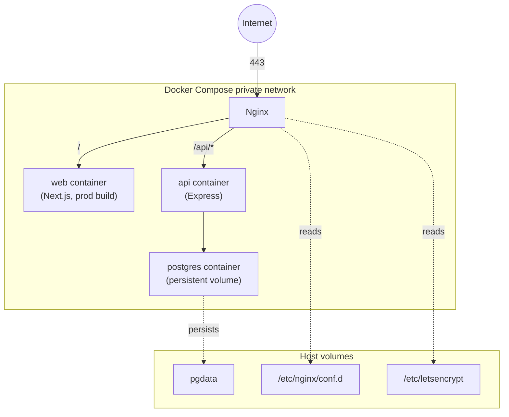

#### Compose Sketch

```yaml
services:
  web:
    image: swrap/web:${TAG}
    restart: unless-stopped
    env_file: [.env.deploy]
    deploy:
      resources:
        limits: { memory: 512M }
    healthcheck:
      test: ["CMD", "wget", "-qO-", "http://localhost:3000/_health"]
      interval: 30s
      timeout: 5s
      retries: 3
  api:
    image: swrap/api:${TAG}
    restart: unless-stopped
    env_file: [.env.deploy]
    depends_on: { postgres: { condition: service_healthy } }
    deploy:
      resources:
        limits: { memory: 384M }
    healthcheck:
      test: ["CMD", "wget", "-qO-", "http://localhost:4000/health?ready=1"]
      interval: 15s
      timeout: 5s
      retries: 3
  postgres:
    image: postgres:16-alpine
    restart: unless-stopped
    env_file: [.env.deploy]
    volumes: ["pgdata:/var/lib/postgresql/data"]
    deploy:
      resources:
        limits: { memory: 512M }
    healthcheck:
      test: ["CMD-SHELL", "pg_isready -U $$POSTGRES_USER"]
      interval: 10s
      timeout: 3s
      retries: 5
  nginx:
    image: nginx:1.27-alpine
    restart: unless-stopped
    ports: ["80:80", "443:443"]
    volumes:
      - "./nginx/conf.d:/etc/nginx/conf.d:ro"
      - "/etc/letsencrypt:/etc/letsencrypt:ro"
    deploy:
      resources:
        limits: { memory: 128M }
    depends_on: [web, api]

volumes:
  pgdata:
```

**Memory budget**: 512 + 384 + 512 + 128 = **1.536 GB** ≤ 1.6 GB target, leaving ~400 MB for the OS and ephemerals on a 2 GB host.

#### TLS

Nginx terminates TLS using Let's Encrypt certificates mounted from the host. All upstream hops (`web`, `api`) speak plain HTTP on the private Docker network. Certificate renewal is run by a host-level `certbot` job; Nginx reload is triggered by a sidecar reload script.

#### Health Checks

- `GET /health` returns `{ ok: true, ready: <bool>, db: <bool>, version: "..." }`. Liveness is HTTP 200; readiness requires `db: true`.
- `GET /_health` on web returns 200 once Next.js is serving.
- Compose `healthcheck` configurations restart the container if unhealthy beyond the grace period.

#### Persistent Volumes

Postgres data lives on the named volume `pgdata`. Container ephemerals are never used for state. Backups are nightly `pg_dump` to a host directory (operator concern; out of scope for this design beyond the volume contract).

### 11. Codebase Cleanup Plan

#### Consolidation Targets

| Concern | Becomes | Removed |
|---|---|---|
| Auth | `apps/web/lib/auth/auth-client.ts` (single module exposing both ZK + wallet) | All other auth helpers; any `useWallet` in components must call this module. |
| Seal client | `apps/web/lib/seal/seal-client.ts` | Any `seal-poc-*`, in-component encryption helpers. |
| Metadata API client | `apps/web/lib/api/metadata-client.ts` | Per-page `fetch` calls; ad-hoc API hooks. |
| Upload handler | `apps/api/services/metadata-orchestrator.ts` + `apps/api/routes/{forms,submissions,files,upload-jobs}.ts` | Duplicate upload routes; legacy POC routes. |
| Walrus client | `apps/web/lib/walrus/walrus-client.ts` | Inline publisher fetches; POC walrus helpers. |

#### Migration Note File

A single file at `docs/migration/walrus-native-migration.md` lists every removed module path and its replacement, e.g.:

```
- removed: apps/api/routes/poc-decrypt.ts        replacement: (none — decryption moved to apps/web/lib/seal/seal-client.ts)
- removed: apps/api/server-config.ts:DEV_*       replacement: (none — env removed)
- removed: apps/web/components/walrus/poc-encrypt-button.tsx  replacement: apps/web/components/submissions/SecureSubmissionButton.tsx
```

#### Static Verification

- **Lint**: `pnpm lint` MUST pass with zero errors and a warning count `≤` the pre-cleanup baseline (recorded in `docs/migration/lint-baseline.txt`).
- **Type-check**: `pnpm typecheck` MUST pass with zero errors.
- **Dead code**: `knip` (or equivalent) MUST report zero unused exports, zero unreferenced React components, zero unregistered route handlers.
- **Removed-import detection**: a TS resolver-based test imports every source file path; failure to resolve any imported module fails the build with the importer + missing path.

### 12. Trust Boundary Enforcement

The Trust_Boundary is a runtime invariant **and** a static invariant.

#### Static Enforcement

- ESLint rule `boundaries/no-server-import-of-seal-plaintext`: forbids `apps/api/**` from importing `apps/web/lib/seal/seal-client.ts` or any module that handles plaintext payloads.
- ESLint rule `no-localstorage-for-ephemeral-keys`: forbids `localStorage.setItem(...)` with keys matching `/zk_eph|seal_session|private_key/i`.
- Allow-list audit (`telemetry-allow-list.test.ts`): scans every `console.*` and `logger.*` call site against an allow-list of fields.

#### Runtime Enforcement

- `auth-client` stores ephemeral keys exclusively in `sessionStorage` (cleared on tab close) and in-memory `CryptoKey`. A defensive write to `localStorage` from anywhere else triggers the static rule.
- `request-logger` redacts unknown fields by default.
- `metadata-client` request body schemas are typed; only fields in the schema serialize.

#### Property-Based Boundary Tests

Property tests (see Testing Strategy) generate Private_Form Submission_Payloads, run the full upload pipeline against a captured-bytes API double, and assert no substring of plaintext or of ZK ephemeral key material appears in any captured byte sequence.

---

## Data Models

### Walrus Blob Schemas

All Walrus blobs are JSON unless declared `application/octet-stream` (file uploads).

#### Form_Definition

```ts
interface FormDefinition {
  schemaVersion: 1;
  id: string;                    // UUID, mirrors forms.id
  version: number;               // mirrors forms.version
  title: string;
  description?: string;
  privacyMode: 'public' | 'private';
  policyId?: string;             // present iff privacy=private
  fields: FormField[];           // schema only, no submission values
  ownerAddress: string;
  createdAt: string;             // ISO8601
}

interface FormField {
  id: string;
  type: 'text' | 'textarea' | 'select' | 'checkbox' | 'file' | 'date' | 'number';
  label: string;
  required: boolean;
  options?: string[];            // for select
  // ...type-specific config
}
```

#### Submission_Payload (Public)

```ts
interface PublicSubmissionPayload {
  schemaVersion: 1;
  formId: string;
  formVersion: number;
  submitterAddress: string;
  submittedAt: string;           // ISO8601
  answers: Record<string, unknown>;  // keyed by FormField.id
}
```

Stored as canonicalized JSON (sorted keys, no whitespace).

#### Submission_Payload (Private)

The blob stored on Walrus is the **Seal ciphertext** of the canonicalized JSON above, plus a small Seal envelope:

```ts
interface PrivateCiphertextEnvelope {
  schemaVersion: 1;
  scheme: 'seal-v1';             // Seal version + KDF identifier
  policyId: string;
  ciphertext: string;            // base64
  // No plaintext fields. No keys. No nonces beyond what scheme requires.
}
```

#### File Attachment

Raw bytes; metadata (`content_type`, `content_digest`, `size_bytes`) lives in Postgres and is asserted by the client at upload time.

### Postgres Models

See the SQL above. Summarized as TypeScript types:

```ts
interface UserRow {
  address: string;
  signerKind: 'zk-login' | 'external-wallet';
  displayName: string | null;
  createdAt: Date;
  lastSeenAt: Date;
}
interface FormRow {
  id: string;
  ownerAddress: string;
  walrusBlobId: string;
  privacyMode: 'public' | 'private';
  policyId: string | null;
  version: number;
  predecessorId: string | null;
  state: UploadState;
  createdAt: Date;
}
interface SubmissionRow {
  id: string;
  formId: string;
  formVersion: number;
  submitterAddress: string;
  walrusBlobId: string;
  privacyMode: 'public' | 'private';
  contentDigest: string;
  sizeBytes: number;
  state: UploadState;
  createdAt: Date;
}
interface FileRow {
  id: string;
  submissionId: string;
  walrusBlobId: string;
  contentType: string;
  sizeBytes: number;
  contentDigest: string;
  state: UploadState;
  createdAt: Date;
}
interface UploadJobRow {
  id: string;
  ownerAddress: string;
  artifactKind: 'form' | 'submission' | 'file';
  artifactId: string | null;
  walrusBlobId: string | null;
  state: UploadState;
  failureReason: string | null;
  createdAt: Date;
  updatedAt: Date;
}
type UploadState = 'pending' | 'encrypting' | 'uploading' | 'uploaded' | 'indexed' | 'failed';
```

### API Envelope Models

```ts
interface CreateSubmissionRequest {
  formId: string;
  formVersion: number;
  walrusBlobId: string;
  contentDigest: string;          // hex SHA-256
  sizeBytes: number;
  privacyMode: 'public' | 'private';
  policyId?: string;              // required iff private
  uploadJobId?: string;           // for idempotent reconcile
}
interface CreateSubmissionResult {
  submissionId: string;
  state: 'indexed';
  createdAt: string;
}
```

### Client State Models

```ts
interface SessionState {
  status: 'anonymous' | 'authenticating' | 'authenticated' | 'expired';
  address?: string;
  signerKind?: 'zk-login' | 'external-wallet';
  expiresAt?: number;             // epoch ms
}

interface UploadJob {
  id: string;
  artifactKind: 'form' | 'submission' | 'file';
  formId?: string;
  privacyMode: 'public' | 'private';
  state: UploadState;
  blobId?: string;
  digest?: string;
  sizeBytes?: number;
  policyId?: string;
  failureReason?: string;
  createdAt: number;
  updatedAt: number;
}
```


---

## Correctness Properties

*A property is a characteristic or behavior that should hold true across all valid executions of a system — essentially, a formal statement about what the system should do. Properties serve as the bridge between human-readable specifications and machine-verifiable correctness guarantees.*

The properties below were derived from the prework analysis of every acceptance criterion and consolidated to remove logical redundancy (e.g., the confidentiality invariants from 2.1, 2.7, 4.6, 12.2, 12.3 collapse into a single substring-scan property; the per-state transition criteria from 6.3–6.7 collapse into a single state-machine validity property). Each property below maps to one or more requirements; together they cover every acceptance criterion that is testable as a universal property.

### Property 1: ZK Login proof round-trip preserves address

*For any* generated valid combination of (Google identity token, ephemeral key pair, salt, nonce, max epoch), the address derived by the client from the JWT and the address returned by the API_Server's `verifyZkProof` function are byte-equal.

**Validates: Requirements 1.1, 1.9**

### Property 2: ZK Login proof tampering is rejected

*For any* valid ZK proof envelope and any single-bit mutation of any field within it, the API_Server's `verifyZkProof` function returns `{ valid: false }`.

**Validates: Requirements 1.9**

### Property 3: ZK ephemeral key placement

*For any* successful Google sign-in, the resulting ephemeral private key bytes appear in `sessionStorage` only and do not appear in `localStorage`, in any IndexedDB store, in any network capture between the Web_App and the API_Server, in any Postgres dump, or in any captured log line.

**Validates: Requirements 1.2, 1.10, 12.2, 12.3, 12.4**

### Property 4: Authentication method switching preserves consistency

*For any* generated sequence of `signInGoogle | connectWallet | logout` operations against the auth client, after each operation the active signer matches the most recent successful operation, and no prior signer's ephemeral key, JWT, or signature material is reachable from `auth-client` exports.

**Validates: Requirements 1.4**

### Property 5: Active signer is the Seal_Signer and the Form_Owner

*For any* authenticated session with active signer `s`, every Seal client encryption call uses `s` as the policy authority and every newly created form's `ownerAddress` equals `s.address`.

**Validates: Requirements 1.5, 1.6**

### Property 6: Ephemeral key expiry blocks signer operations

*For any* auth session whose `maxEpoch < currentEpoch`, every Seal client encryption or decryption call returns `RequiresReauthError` before issuing any network request.

**Validates: Requirements 1.7**

### Property 7: Seal encryption round-trip

*For any* generated plaintext payload `p` and any generated authorized signer `s`, `seal_decrypt(seal_encrypt(p, policy(s)), s)` deep-equals `p`.

**Validates: Requirements 2.1**

### Property 8: Seal encryption is non-deterministic but functionally invariant

*For any* generated plaintext payload `p`, two independent encryptions of `p` for the same policy produce ciphertexts `c1 ≠ c2` (with overwhelming probability over Seal nonces) and both `seal_decrypt(c1, s) == p` and `seal_decrypt(c2, s) == p` for the authorized signer `s`.

**Validates: Requirements 2.1**

### Property 9: Seal encryption output structure and digest correctness

*For any* successful Seal encryption call, the returned tuple contains a non-empty ciphertext, a non-empty `policyId`, and a `digest` such that `digest == SHA-256(ciphertext)`.

**Validates: Requirements 2.3**

### Property 10: Seal_Policy authorizes the Form_Owner for every private encryption

*For any* private form with owner `o` and any generated submission payload, the `policyId` returned by `seal-client.encrypt` resolves to a policy whose authorized signer set contains `o`.

**Validates: Requirements 2.2, 4.3**

### Property 11: Confidentiality across the upload pipeline

*For any* generated Private_Form Submission_Payload `p` (with a sufficiently long random distinctive substring), the bytes captured at the API_Server boundary, the bytes persisted in Postgres_Store, and the bytes captured in any log line during the upload pipeline contain no substring of `p` and no bytes of any Seal session key or ZK Login ephemeral private key associated with the same flow.

**Validates: Requirements 2.1, 2.7, 4.6, 12.2, 12.3, 12.4, 12.6**

### Property 12: Plaintext is unreachable after encryption returns

*For any* generated plaintext `p`, after `seal-client.encrypt(p, …)` resolves, no module reachable from `seal-client`'s exports holds a reference whose serialization contains a substring of `p`.

**Validates: Requirements 2.4**

### Property 13: Unauthorized decryption issues no network request

*For any* generated `(ciphertext, policyId, signer)` triple where `signer` is not in the policy's authorized set, `seal-client.decrypt` throws `UnauthorizedSignerError` and the Seal-network spy records zero outbound calls.

**Validates: Requirements 2.5**

### Property 14: Walrus put precedes API post; failed put aborts API call

*For any* generated artifact creation flow (form, submission, or file), the Walrus PUT call timestamp precedes the API POST call timestamp, and if the Walrus PUT fails, no API POST occurs.

**Validates: Requirements 3.1, 3.2, 3.3**

### Property 15: Walrus storage round-trip

*For any* generated byte payload `b`, fetching the blob written by `walrus_put(b)` and recomputing its digest yields `digest(b)`, and the returned bytes deep-equal `b`.

**Validates: Requirements 3.6**

### Property 16: Walrus integrity verification rejects digest mismatches

*For any* generated `(recordedDigest, fetchedBytes)` pair where `SHA-256(fetchedBytes) ≠ recordedDigest`, the renderer throws `IntegrityError` and produces no rendered output.

**Validates: Requirements 3.7**

### Property 17: Walrus fetch retry is bounded

*For any* generated sequence of `N` transient Walrus failures followed by a success, with `N ≤ MAX_ATTEMPTS - 1`, the client issues exactly `N + 1` Walrus calls and returns the successful response; for `N ≥ MAX_ATTEMPTS`, the client issues exactly `MAX_ATTEMPTS` calls and returns `WalrusFetchError`.

**Validates: Requirements 3.8**

### Property 18: Public submission round-trip

*For any* Public_Form and any generated `Submission_Payload` `s`, after the upload pipeline completes, the bytes fetched from Walrus via the API-returned blob ID, when JSON-parsed, deep-equal `s`.

**Validates: Requirements 3.6, 4.2**

### Property 19: Privacy mode mismatch is rejected

*For any* form with recorded privacy mode `M` and any generated submission metadata request asserting privacy mode `M' ≠ M`, the API_Server returns a 400 response with `code = "PrivacyModeMismatch"` and writes no row.

**Validates: Requirements 4.5**

### Property 20: Privacy mode change creates a new version and preserves prior submissions

*For any* form `f` with a non-empty set of prior submissions, after a privacy mode change is applied, all prior submission rows remain bytewise identical, the form's `version` increments, a new `forms` row exists with `predecessor_id = f.id`, and prior submissions remain decryptable under their original Seal_Policy.

**Validates: Requirements 4.7**

### Property 21: Postgres metadata schema contains no payload bodies

*For any* generated sequence of valid metadata insertions and queries, no row column type is `bytea`, no column name matches `body|plaintext|cipher|private_key`, and no query result contains a value whose size exceeds the declared metadata size budget.

**Validates: Requirements 3.4, 5.4, 12.4**

### Property 22: Walrus blob ID uniqueness per table

*For any* table that records `walrus_blob_id` and any generated blob ID, the second insertion of that blob ID into the same table fails with a unique-constraint violation.

**Validates: Requirements 5.5**

### Property 23: Foreign keys enforce referential integrity

*For any* generated submissions insert with a `form_id` not present in `forms`, the insert fails with a foreign-key violation, and likewise for files-to-submissions.

**Validates: Requirements 5.6**

### Property 24: Filter queries return exactly matching rows

*For any* generated set of metadata rows and any filter combination over `(owner_address, form_id, state)`, the API response contains exactly the rows whose columns satisfy the filter and no others.

**Validates: Requirements 5.7**

### Property 25: Upload state machine transition validity and initial state

*For any* generated sequence of operations against an Upload_Job, every reached state belongs to `{pending, encrypting, uploading, uploaded, indexed, failed}`, every transition matches a declared edge in the state diagram, and every newly created job starts in `pending`.

**Validates: Requirements 6.1, 6.2, 6.3, 6.4, 6.5, 6.6, 6.7**

### Property 26: Retry from failed is idempotent

*For any* failed Upload_Job and any number `k ≥ 1` of retries from the same recovery point, the final state, recorded blob ID, and observable side effects are equal to those produced by exactly one retry.

**Validates: Requirements 6.8**

### Property 27: Upload_Job state persistence round-trip

*For any* generated sequence of Upload_State_Machine transitions, persisting every transition to IndexedDB and reloading produces a state machine whose state, blob ID, digest, and policy ID equal the originals; resuming continues from the persisted state.

**Validates: Requirements 6.11**

### Property 28: Orphan detection after timeout

*For any* Upload_Job in state `uploaded` continuously for longer than `ORPHAN_TIMEOUT_MS`, `isOrphan(job)` is true and the UI exposes both `reconcile` and `discard` affordances.

**Validates: Requirements 6.10**

### Property 29: Upload phase UX mapping

*For any* state `s` in the Upload_State_Machine, `ux-copy.uploadPhase(s)` returns the documented phase string and the rendered progress UI for a job in state `s` displays exactly that string (and no internal state name).

**Validates: Requirements 6.9, 8.6**

### Property 30: Authorization gating on metadata writes

*For any* generated metadata write request whose session-bound address differs from the targeted form's owner, the API_Server returns 403 `Forbidden`, no row is written, and an `activity` row with `outcome = "denied"` is appended.

**Validates: Requirements 7.4**

### Property 31: Typed response envelope shape

*For any* request to any registered API route, the response body conforms to the `ApiResponse<T>` envelope, including a `requestId`, a `status` matching the HTTP status code, and exactly one of `result` or `error`.

**Validates: Requirements 7.5**

### Property 32: Walrus blob existence is verified before `indexed`

*For any* metadata write referencing a `walrus_blob_id` not present on Walrus_Store, the API_Server returns 404 `BlobNotFound` and writes no row in state `indexed`.

**Validates: Requirements 7.7**

### Property 33: Atomic validation: invalid writes persist nothing

*For any* request that fails server-side validation (schema, authorization, privacy mode, blob existence), the API_Server returns a typed error response and the row count of every metadata table remains unchanged from before the request.

**Validates: Requirements 7.8**

### Property 34: Payload limit enforcement

*For any* request whose body size exceeds the configured `Payload_Limit`, the API_Server returns 413 `PayloadTooLarge`; for any request whose body size is within the limit, the request proceeds to the route handler.

**Validates: Requirements 9.4**

### Property 35: Rate limiter sliding window

*For any* sliding window of generated request rates from a single (address, IP) pair, once the rate exceeds the configured threshold the API_Server returns 429 `TooManyRequests` with a `Retry-After` header, and after the window resets, subsequent valid requests resume returning 2xx.

**Validates: Requirements 9.5, 9.10**

### Property 36: Env validator is total on required keys

*For any* generated environment configuration that omits or malforms any required key, API_Server startup exits non-zero with a `config_invalid` log; for any valid environment configuration, startup succeeds.

**Validates: Requirements 9.6**

### Property 37: CORS allow-list is exact

*For any* request whose `Origin` header is in the configured allow-list, the API_Server includes a matching `Access-Control-Allow-Origin` header; for any `Origin` not in the allow-list, the API_Server omits the header (and rejects preflight with 403).

**Validates: Requirements 9.7**

### Property 38: Security headers are present on every response

*For any* response from any registered route, the headers `Strict-Transport-Security`, `X-Content-Type-Options`, `Referrer-Policy`, and `Content-Security-Policy` are present with their declared values.

**Validates: Requirements 9.8**

### Property 39: Structured logging contains no payload bodies

*For any* request to any registered route, every emitted log line conforms to the structured-record schema and contains no field whose value is a request body, response body, JWT, ZK proof, signature, ciphertext, or plaintext.

**Validates: Requirements 7.6, 9.9, 12.6**

### Property 40: Legacy detector triggers exit on disallowed code paths

*For any* injected legacy artifact (a route registered at `/decrypt` or `/poc-decrypt`, an export named `bypassAuth`/`pocDecrypt`/`serverDecrypt`, or a config key matching `INFRA_WALLET_PRIVATE_KEY|DEV_BYPASS_STORAGE|DEV_LOCAL_SIGNER|DEV_ALLOW_PLAINTEXT`), API_Server startup logs `legacy_detected` at critical and exits non-zero; for any clean repository state, startup proceeds.

**Validates: Requirements 9.1, 9.2, 9.3, 9.11**

### Property 41: Primary-flow UI does not display raw chain identifiers

*For any* rendered component declared as primary-flow, its rendered text contains no string matching the Walrus blob ID format, the Sui transaction hash format, the Seal_Policy ID format, or a raw signer address (under the configuration `advancedView = false`).

**Validates: Requirements 8.2**

---

## Error Handling

### Error Taxonomy

| Surface | Code | HTTP | Recoverable | UX phrase |
|---|---|---|---|---|
| Auth | `Unauthorized` | 401 | yes (re-auth) | "Sign in again" |
| Auth | `AuthExpired` | 401 | yes | "Your session expired — sign in again" |
| Auth (client) | `RequiresReauthError` | n/a | yes | "Sign in to continue" |
| Authorization | `Forbidden` | 403 | no | "You don't have access to that" |
| Validation | `BadRequest` / `Validation` | 400 | depends | "Something looks off — review and retry" |
| Privacy mismatch | `PrivacyModeMismatch` | 400 | no | "This form's privacy changed — refresh" |
| Conflict | `Conflict` | 409 | yes (idempotent) | (used for optimistic concurrency) |
| Not found | `NotFound` | 404 | no | "We couldn't find that" |
| Walrus | `BlobNotFound` | 404 | yes | "Saving — almost there" (retry path) |
| Walrus | `IntegrityMismatch` | n/a | no | "We can't trust this content" |
| Server | `Internal` | 500 | yes (transient) | "Something went wrong — retrying" |
| Limit | `PayloadTooLarge` | 413 | no | "That submission is too large" |
| Limit | `TooManyRequests` | 429 | yes (after `Retry-After`) | "Too many requests — pausing" |
| Seal | `UnauthorizedSignerError` | n/a | no | "This response isn't yours" |
| Seal | `EncryptionFailed` | n/a | yes | "Couldn't secure your submission — retry" |
| Walrus | `WalrusFetchError` | n/a | yes | "Couldn't reach storage — retry" |

### Client Failure Modes

Each Upload_Job failure is recorded with:

```ts
{ state: 'failed', failureReason: 'EncryptionFailed' | 'WalrusPutFailed' | 'IndexFailed' | ... }
```

The retry button maps each `failureReason` to the earliest non-completed step (see Upload State Machine). Idempotency keys: `(formId, walrusBlobId)` for submissions, `(submissionId, walrusBlobId)` for files. Server upserts on these keys make retries safe.

### Server Failure Modes

- All errors are caught by `error-handler` middleware and serialized as the typed envelope.
- Internal errors are logged with the request ID, stack trace, and a synthetic correlation ID. The response omits stack traces in production.
- Validation errors include the failing field paths but never the field values.
- Authorization errors append an `activity` row with `outcome = 'denied'`.

### Walrus Failure Modes

- Transient (5xx, 429, network): retried with bounded exponential backoff (Property 17).
- 404 on read after a successful write: treated as transient up to a small grace window (publisher → aggregator propagation), then surfaced.
- Integrity mismatch: never retried; surfaced immediately as `IntegrityMismatch`.

### Auth Failure Modes

- ZK ceremony failure: cleared session state, no partial record, actionable error.
- Wallet rejection: same.
- Epoch expiry mid-flight: in-flight Seal operations short-circuit to `RequiresReauthError`; pending Upload_Jobs pause and the UI prompts re-auth.

---

## Testing Strategy

### Approach

Property-based testing (PBT) IS appropriate for this feature. The codebase is full of pure or near-pure functions with universal invariants: Seal encryption round-trips, Walrus storage round-trips, the upload state machine, the API authorization predicate, the typed response envelope, the retry policy, the rate limiter window, and the trust-boundary substring scans. A few requirement clusters (VPS deployment, codebase cleanup, UX vocabulary copy) are not PBT-suitable and are tested with smoke / static analysis / snapshot tests, as classified in the prework.

The strategy combines:

1. **Property-based tests** (`fast-check`) for the Correctness Properties above. Every property in the list maps to one property-based test.
2. **Example-based unit tests** for specific scenarios (UI entry points, copy snapshots, advanced view toggle, error message wording).
3. **Integration tests** (Vitest + Supertest + ephemeral Postgres) for end-to-end metadata flows, schema constraints, FK / unique violations, and CORS / security-header presence.
4. **Smoke tests** for deployment configuration (Compose memory budget parser, image audit, migration tool presence).
5. **Static analysis** (ESLint custom rules, TypeScript, `knip`-equivalent dead-code, AST-level "single module per concern" counters, removed-import resolver checks).

### PBT Library and Configuration

- **Library**: `fast-check` (already used: see `apps/api/forms.pbt.test.ts`, `apps/api/submissions.pbt.test.ts`).
- **Iterations**: ≥ 100 per property test (`fc.assert(predicate, { numRuns: 100 })`). Trust-boundary substring properties run ≥ 200 iterations.
- **Tagging**: every property test carries a comment of the form:
  ```
  // Feature: walrus-native-zk-login-architecture, Property 11: Confidentiality across the upload pipeline
  ```
  CI parses these tags and asserts every numbered property has at least one matching test.
- **Generators**: shared `apps/web/test-support/generators.ts` provides `arbForm`, `arbPublicSubmission`, `arbPrivateSubmission` (with random distinctive plaintext substrings for the confidentiality scan), `arbSigner`, `arbZkProofEnvelope`, `arbValidEnv`, `arbInvalidEnv`, `arbUploadTransitionSequence`, `arbWalrusFailureSequence`.

### Property-to-Test-Surface Mapping

| Property | Test surface | Library / harness |
|---|---|---|
| 1, 2 (ZK proof round-trip + tampering) | `apps/api/auth/zk-verify.pbt.test.ts` against a deterministic ZK fixture generator | `fast-check`, `@mysten/zklogin` test bindings |
| 3 (ephemeral key placement) | `apps/web/lib/auth/auth-client.boundary.test.ts` with `sessionStorage`/`localStorage` spies + jsdom + network capture | `fast-check`, `vitest`, jsdom |
| 4 (signer switching) | `apps/web/lib/auth/auth-client.switch.pbt.test.ts` | `fast-check` |
| 5 (active signer binding) | `apps/web/lib/seal/seal-client.binding.pbt.test.ts` and `apps/web/lib/api/metadata-client.owner.pbt.test.ts` | `fast-check` |
| 6 (epoch expiry) | `apps/web/lib/auth/auth-client.epoch.pbt.test.ts` (clock control) | `fast-check`, `vitest` fake timers |
| 7, 8, 9, 10 (Seal encrypt round-trip, non-determinism, output structure, policy authorizes owner) | `apps/web/lib/seal/seal-client.pbt.test.ts` against a Seal test harness or a Seal stub conforming to the same algebraic interface | `fast-check` |
| 11 (confidentiality pipeline) | `apps/web/lib/upload/upload-pipeline.boundary.pbt.test.ts` — runs full pipeline against a capture proxy that records every byte sent to API and every Postgres write | `fast-check`, custom capture proxy |
| 12 (zeroization) | `apps/web/lib/seal/seal-client.zeroize.pbt.test.ts` — uses a heap-introspection helper that scans seal-client's reachable graph | `fast-check`, custom heap walker |
| 13 (no decrypt request when unauthorized) | `apps/web/lib/seal/seal-client.unauthorized.pbt.test.ts` with Seal-network spy | `fast-check` |
| 14 (walrus put precedes API post) | `apps/web/lib/upload/order.pbt.test.ts` with timestamp spies | `fast-check` |
| 15, 16, 17 (walrus round-trip, integrity, retry) | `apps/web/lib/walrus/walrus-client.pbt.test.ts` against a Walrus test double | `fast-check` |
| 18 (public submission round-trip) | `apps/web/e2e/public-submission.pbt.test.ts` with a real testnet publisher in CI-nightly and a mock in CI-pr | `fast-check` |
| 19 (privacy mismatch rejected) | `apps/api/routes/submissions.privacy.pbt.test.ts` | `fast-check`, supertest |
| 20 (versioning preserves prior submissions) | `apps/api/routes/forms.version.pbt.test.ts` with a Postgres test container | `fast-check`, supertest, `@testcontainers/postgresql` |
| 21 (schema confidentiality) | `db/schema.pbt.test.ts` + `db/lint/forbidden-columns.sql` | `fast-check` |
| 22 (uniqueness) | `apps/api/repos/forms.unique.pbt.test.ts`, same for submissions, files | `fast-check`, Postgres test container |
| 23 (foreign keys) | `apps/api/repos/fk.pbt.test.ts` | `fast-check`, Postgres test container |
| 24 (filter queries) | `apps/api/routes/forms.filter.pbt.test.ts`, `apps/api/routes/submissions.filter.pbt.test.ts` | `fast-check`, supertest |
| 25 (state machine validity) | `apps/web/lib/upload/state-machine.pbt.test.ts` | `fast-check` |
| 26 (retry idempotence) | `apps/web/lib/upload/state-machine.retry.pbt.test.ts` | `fast-check` |
| 27 (state persistence) | `apps/web/lib/upload/state-machine.persist.pbt.test.ts` with a fake-IndexedDB | `fast-check`, `fake-indexeddb` |
| 28 (orphan detection) | `apps/web/lib/upload/orphan.pbt.test.ts` with fake timers | `fast-check`, vitest fake timers |
| 29 (UX phase mapping) | `apps/web/lib/copy/ux-copy.pbt.test.ts` and `apps/web/components/upload/UploadProgress.snap.test.tsx` | `fast-check`, vitest snapshot |
| 30 (authorization gating) | `apps/api/routes/auth.guard.pbt.test.ts` | `fast-check`, supertest |
| 31 (envelope shape) | `apps/api/error-envelope.pbt.test.ts` (extends existing) | `fast-check`, supertest |
| 32 (blob existence pre-check) | `apps/api/services/walrus-existence.pbt.test.ts` | `fast-check` |
| 33 (atomic validation) | `apps/api/routes/atomicity.pbt.test.ts` with row-count snapshots | `fast-check`, Postgres test container |
| 34 (payload limit) | `apps/api/middleware/payload-limit.pbt.test.ts` | `fast-check`, supertest |
| 35 (rate limiter window) | `apps/api/middleware/rate-limit.pbt.test.ts` | `fast-check`, supertest, fake timers |
| 36 (env validator) | `apps/api/server-config.pbt.test.ts` | `fast-check` |
| 37 (CORS allow-list) | `apps/api/middleware/cors.pbt.test.ts` | `fast-check`, supertest |
| 38 (security headers) | `apps/api/middleware/security-headers.pbt.test.ts` | `fast-check`, supertest |
| 39 (structured logging redaction) | `apps/api/middleware/request-logger.pbt.test.ts` with log capture | `fast-check`, supertest |
| 40 (legacy detector) | `apps/api/legacy-detector.pbt.test.ts` injecting synthetic legacy artifacts | `fast-check` |
| 41 (no chain IDs in primary flows) | `apps/web/components/__tests__/no-raw-ids.pbt.test.tsx` rendering generated metadata into primary-flow components | `fast-check`, `@testing-library/react` |

### Non-PBT Tests

- **Smoke / Compose audit**: `infra/compose-audit.test.ts` parses `docker-compose.yml`, sums declared memory limits, asserts ≤ 1.6 GB, asserts `restart: unless-stopped` on every service, asserts the named volume `pgdata` is declared.
- **Image audit**: `infra/image-audit.test.ts` runs `docker image inspect` and asserts the runtime web image contains no build toolchains (`tsc`, `webpack`, `next` dev dependencies).
- **Migration presence**: `db/migrations/__tests__/presence.test.ts` asserts at least one migration file exists, asserts each migration has an `up` SQL block, asserts the migration tool is configured.
- **UI snapshots**: `apps/web/components/__tests__/copy.snap.test.tsx` snapshots privacy mode labels, the "your account" copy, the advanced-view toggle behavior.
- **Static analysis suite**: a `pnpm verify` script that runs `lint`, `typecheck`, `knip`, the AST module-count checks (single auth module, single Seal client, single metadata client, single upload handler), and the removed-import resolver check. CI fails the build on any violation.
- **CI configuration check**: `ci/test-suite-presence.test.ts` asserts the boundary test suites are wired into `pnpm test`.

### Coverage Requirements

- Every property in the Correctness Properties section MUST have at least one PBT test tagged with its property number.
- Every requirement that classified to `PROPERTY` in the prework MUST be covered by at least one of those PBT tests (reverse mapping verified by a CI script).
- Every requirement that classified to `EXAMPLE` / `EDGE_CASE` / `SMOKE` / `INTEGRATION` MUST be covered by at least one corresponding non-PBT test.

---

## Migration Strategy

Migration is **incremental**. The sequence below is one-way: each step is an isolated PR that leaves `main` deployable.

1. **Schema bring-up.** Introduce `node-pg-migrate`, write the new schema migrations, point the existing API at the new tables behind a feature flag. (Feature flag is **not** a Bypass_Auth flag; it's a routing toggle for storage location, removed in step 8.)
2. **Walrus client consolidation.** Replace inline publisher calls in `apps/web/components/walrus/*` with the canonical `walrus-client`. Old helpers are deleted.
3. **Seal client consolidation.** Replace any in-component encryption calls with `seal-client`. Add the policy-binding contract.
4. **Auth module consolidation.** Stand up `auth-client`. Add the ZK Login flow next to the existing wallet flow. Add `zk-verify` to the API. Server keeps wallet-signature path through migration.
5. **Metadata API client + typed envelope.** Refactor every component to import from `metadata-client`. Tighten `error-envelope` to the typed contract.
6. **Upload state machine.** Replace ad-hoc upload progress with `upload-state-machine`. Add IndexedDB persistence, orphan reconciliation UI.
7. **Privacy modes wiring end-to-end.** UI mode selector → metadata `privacyMode` → server enforcement → versioning on change.
8. **Hardening pass.** Remove `Bypass_Auth`, `POC_Decrypt_Route`, `INFRA_WALLET_PRIVATE_KEY`. Add legacy detector, payload limit, rate limiter, env validator, CORS allow-list, security headers. Remove the schema feature flag from step 1.
9. **Cleanup pass.** Run `knip`, dead-code removal, single-module enforcement, write `docs/migration/walrus-native-migration.md`, lock lint baseline.
10. **VPS deployment.** Author Docker Compose, Nginx config, healthchecks, persistent volumes. Stand up on the 2 GB DigitalOcean droplet.

Each step adds tests. After step 8, the full property-based test suite (Properties 1–41) MUST pass.

## Risks

| Risk | Likelihood | Impact | Mitigation |
|---|---|---|---|
| Seal SDK API drift between testnet versions during migration | Medium | High | Pin the SDK; gate `seal-client` on a single version; isolate the encrypt/decrypt surface so swap is local. |
| ZK prover availability or latency during sign-in | Medium | High | Show a "Securing your account" state with a long but bounded timeout; offer wallet sign-in as fallback in the same UI. |
| Walrus publisher / aggregator outages | Medium | Medium | Bounded retry with backoff (Property 17); orphan reconciliation; visible "Saving" state. |
| 2 GB VPS memory pressure | Medium | Medium | Memory limits in Compose total ≤ 1.6 GB; healthcheck + restart; alert on OOM kills via host log driver. |
| Incidental plaintext leak via a logging library default | Low | High | Allow-list logger fields; property-based confidentiality scan; CI test fails the build on plaintext appearance. |
| Privacy mode change racing with in-flight submissions | Low | Medium | Versioning preserves prior submissions (Property 20); in-flight UI re-validates before submitting. |
| ZK ephemeral key inadvertently logged from a 3rd-party library | Low | High | All logging routes through `request-logger` with redaction; `localStorage` writes for key-shaped names are forbidden by lint and verified by Property 3. |
| Migration tool drift across environments | Low | Medium | `pnpm migrate up` runs in CI and at deploy time; migration history is committed. |

## Open Questions / Future Work

- **Shared / Protected modes** (`Protected` = explicit named-grantee read access; `Secure` = multi-sig policy). The schema includes `permissions` as a placeholder; the UX terms are reserved. Implementation deferred.
- **Wallet-to-ZK account binding** (claim a ZK Login account into a wallet for portability). Hooks exist in the auth module; flow is not in this iteration.
- **Operator-level orphan sweeper.** The client reconciles orphans; a server-side sweeper for very-stale `upload_jobs` is a future enhancement.
- **Mainnet readiness.** Architecture is mainnet-ready; cutover (cost, throughput, fee policy) is its own design.
