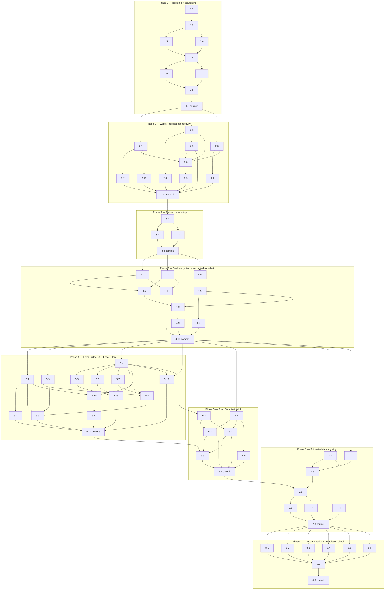

# Implementation Plan: Walrus Testnet POC

Convert the feature design into a series of prompts for a code-generation LLM that will implement each step with incremental progress. Make sure that each prompt builds on the previous prompts, and ends with wiring things together. There should be no hanging or orphaned code that isn't integrated into a previous step. Focus ONLY on tasks that involve writing, modifying, or testing code.

## Overview

This plan implements the Walrus Testnet POC on branch `walrus-poc` (forked from tag `v0-baseline`). All code is **additive**: the existing `src/lib/{seal,walrus,wallet}/*` and `src/app/api/{forms,submissions,upload}/*` files are never edited. Work is structured into eight sequential phases (0–7), each ending with a single Conventional Commits commit on `walrus-poc` that passes `scripts/phase-verify.sh`.

**Implementation language:** TypeScript (inferred from design.md, which already commits to `@mysten/sui`, Zod, Next.js 15, and `next/font/google`).

**Testing library:** Vitest + fast-check. Installed once in Phase 0.

**PBT discipline:** every task that produces logic either produces a paired `*.pbt.test.ts` or explicitly names the R17 invariant it validates. Property tests are **never standalone tasks** — they are sub-tasks under the implementation task that creates the code under test.

**Scope guardrails (R18, R19.9, R19.10):** no OAuth / RBAC / billing / multi-tenant / VPS / K8s / KMS / queues / analytics / CDN; no drag-heavy builders; no charts or sparklines on the dashboard.

---

## Tasks

- [ ] 1. Phase 0 — Baseline + monorepo scaffolding
  - [ ] 1.1 Confirm baseline and branch prerequisites
    - Verify `git rev-parse v0-baseline` resolves and `git merge-base --is-ancestor v0-baseline HEAD` exits 0 on the current `walrus-poc` branch.
    - Add `scripts/check-baseline.sh` that runs both checks and fails fast with a descriptive error if either is missing.
    - _Requirements: R1.3, R1.4, R16.5_

  - [ ] 1.2 Create `apps/` and `packages/` directory skeleton
    - Create empty-but-real folders: `apps/web/{pages,components/ui,components/layout,components/forms,components/walrus,components/submissions,stores,copy}`, `apps/api/`, `packages/{shared,seal,walrus,sui}/src/`, `packages/sui/move/sealbase_poc/sources/`.
    - Add one `index.ts` per package re-exporting `export {}` so TypeScript `include` finds each folder.
    - Leave `src/app/poc/` and `src/app/api/poc/` as placeholder folders with a single `.gitkeep`; real wrappers land in later phases.
    - _Requirements: R14.1, R14.7_

  - [ ] 1.3 Wire tsconfig path aliases and include globs
    - Extend `tsconfig.json` `compilerOptions.paths` with `@poc/shared`, `@poc/shared/*`, `@poc/seal`, `@poc/seal/*`, `@poc/walrus`, `@poc/walrus/*`, `@poc/sui`, `@poc/sui/*`, `@poc/apps/web`, `@poc/apps/web/*`, `@poc/apps/api`, `@poc/apps/api/*`.
    - Extend `include` with `"apps/**/*", "packages/**/*"`.
    - Add narrower `tsconfig.poc.json` and `tsconfig.poc-api.json` configs (extends root) with `include` limited to `apps/web/**` + package deps and `apps/api/**` + package deps respectively, each used only for `tsc --noEmit` verification.
    - Confirm `npm run type-check` still passes.
    - _Requirements: R14.1, R14.6, R14.8_

  - [ ] 1.4 Install test runner, fast-check, and dev dependencies
    - Add devDependencies to root `package.json`: `vitest`, `@vitest/ui`, `vite-tsconfig-paths`, `fast-check`, `msw`, `js-yaml`, `@types/js-yaml`, `wcag-contrast` (or `@adobe/leonardo-contrast-colors`).
    - Add scripts: `test`, `test:run` (`vitest run`), `test:pbt` (`vitest run --dir packages --reporter=verbose`), `lint:ui` (placeholder echoing "ok" until Phase 4 adds the real composite).
    - Create root `vitest.config.ts` with `plugins: [tsconfigPaths()]`, `test.include: ['apps/**/*.test.ts', 'apps/**/*.test.tsx', 'packages/**/*.test.ts']`, `test.environment: 'node'` (overridable per-file for jsdom where needed).
    - _Requirements: R17 (enables all invariants), R14.6_

  - [ ] 1.5 Create `packages/shared/src/design-tokens.ts` with exact tables from design.md
    - Export `spacing`, `radius`, `typography`, `color`, `elevation`, `motion`, `focusRing` objects exactly as specified in design.md §"Design_Tokens module".
    - Every export is `as const` with matching TypeScript types (`Spacing`, `Radius`, etc.).
    - Re-export from `packages/shared/src/index.ts`.
    - _Requirements: R19.1, R19.2, R19.4_

  - [ ] 1.6 Bind Tailwind config to Design_Tokens programmatically
    - Rewrite `tailwind.config.ts` on `walrus-poc` so `theme.extend.spacing`, `colors`, `borderRadius`, `boxShadow`, `fontFamily`, `fontSize`, and `transitionDuration` are produced by a local helper (e.g. `buildTailwindTheme()`) that imports from `@poc/shared` and maps tokens to Tailwind keys.
    - Add `theme.screens` breakpoints sourced from `design-tokens` (360, 768, 1280, 1536, 1920 px).
    - Confirm `npm run build` still succeeds on the existing `src/app/**` pages (no visual regressions are acceptable since the existing Tailwind color set is a superset of the token palette — mapping must preserve current named keys).
    - _Requirements: R19.1, R19.4_

  - [ ] 1.7 Add POC-scoped ESLint rules
    - Extend `.eslintrc.json` with an `overrides` block scoped to `apps/web/**` and `src/app/poc/**`:
      - `no-restricted-syntax` patterns:
        - `Literal[value=/class(Name)?="[^"]*\[/]` (arbitrary-value Tailwind classes)
        - `Literal[value=/#[0-9a-f]{3,8}/i]` (hex color literals)
        - `Literal[value=/\\b\\d+ms\\b/]` inside `className`/`style` (literal ms values)
        - `Literal[value=/decentralized|blob storage|aggregator|publisher|finalization|seal encrypt|AES-GCM|walrus/i]` (banned UX copy strings)
    - Extend overrides scoped to `packages/**/*.ts` with `no-restricted-imports` forbidding `@poc/apps/*` imports (R14.2–R14.5).
    - Extend overrides scoped to `apps/web/components/{forms,walrus,submissions}/**` with `no-restricted-paths` forbidding peer imports between those three folders (R19.12).
    - Confirm `npm run lint` passes on the empty scaffolding.
    - _Requirements: R14.2, R14.3, R14.4, R14.5, R19.2, R19.8, R19.11, R19.12_

  - [ ] 1.8 Add `scripts/phase-verify.sh` reusable phase gate
    - Shell script at `scripts/phase-verify.sh` executing, in order: `npm run type-check`, `npm run lint`, `npm run build`, `npm run test:run`, a curl happy-path smoke probe against `/api/poc/health` (skipped when the route doesn't exist yet via `--allow-missing-route` flag), and `git merge-base --is-ancestor v0-baseline HEAD`.
    - Exit non-zero with a clear stage label on first failure.
    - `chmod +x`; verify it runs green on the current empty scaffolding.
    - _Requirements: R16.2, R16.3, R16.4, R16.5, R16.6, R14.6, R14.8_

  - [ ] 1.9 Phase 0 checkpoint and commit
    - Run `scripts/phase-verify.sh` — expect green.
    - Commit on `walrus-poc` with message `feat: scaffold walrus-poc monorepo and design tokens`.
    - Ensure all tests pass, ask the user if questions arise.
    - _Requirements: R1.4, R16.1, R16.2, R16.5_

- [ ] 2. Phase 1 — Wallet + testnet connectivity
  - [ ] 2.1 Implement `packages/shared/src/env.ts` Env_Loader
    - Export `PocEnvSchema`, `PocEnv` type, `EnvLoadError`, `loadPocEnv`, `_resetPocEnvForTesting` per design.md.
    - Parse the five POC flags with `StrictBool` (reject anything other than case-insensitive `"true"`/`"false"`).
    - Emit the redacted one-line JSON summary exactly once on first successful load.
    - Enforce the `NODE_ENV=production && !POC_ALLOW_PROD` safety fuse.
    - _Requirements: R2.1, R2.2, R2.9_

  - [ ] 2.2 Env_Loader unit + property tests
    - Unit tests: valid env loads, each missing flag produces `EnvLoadError` naming that flag, case-insensitive `"TRUE"` accepted, `"1"`/`"yes"` rejected, cache returns the same instance.
    - `*.pbt.test.ts` using fast-check: **Property: parse(serialize(env)) == env for all valid boolean combinations** (generate all 2⁵ = 32 flag combinations + arbitrary valid URLs; assert `loadPocEnv(serialized).flags` matches input after cache reset). Not an R17 invariant — this is unit hardening only.
    - _Requirements: R2.1, R2.9_

  - [ ] 2.3 Implement `packages/sui/src/signer-detector.ts`
    - `detectLocalSigner()` reads `~/.sui/sui_config/client.yaml`, resolves `active_address` + `active_env`, reads `~/.sui/sui_config/sui.keystore`, iterates entries, and returns the first keypair whose `.toSuiAddress()` matches.
    - Support `Ed25519Keypair`, `Secp256k1Keypair`, `Secp256r1Keypair`.
    - Wrap in `PocSigner` closure exposing only `scheme`, `address`, `getPublicKey`, `signPersonalMessage`, `signTransaction`, `deriveSymmetricKey(salt, info)`.
    - Raise `SignerDetectorError` with the six codes from design.md.
    - Install runtime deps: `@mysten/sui`, `js-yaml` (already added in 1.4).
    - _Requirements: R3.1, R3.2, R3.3, R3.5, R3.6, R3.7_

  - [ ] 2.4 Signer_Detector "no-secret-leak" invariant test
    - Unit tests: each error code is surfaced for the correct filesystem fault; address matching across all three schemes uses fixtures.
    - `*.pbt.test.ts`: **R17 supporting invariant — PocSigner never serializes secret bytes.** fast-check generates random `PocSigner` constructions; assert `JSON.stringify(signer)`, `String(signer)`, `util.inspect(signer)`, and enumeration of `Object.keys(signer)` never contain any byte of the source secret.
    - _Requirements: R3.7, R17.7 (plaintext-leak precondition)_

  - [ ] 2.5 Implement `packages/sui/src/sui-client.ts`
    - Export `createSuiClient`, `getBalance(client, address)`, `signAndExecuteTestMessage(signer)` (sign + verify a static "sealbase-poc-handshake" payload), `executeTransaction(client, tx, signer)`, `queryMetadataRecords(client, packageId, owner)` (stub returning `[]` until Phase 6 lands the Move module).
    - All functions accept an `AbortSignal` wired to a 10-second default timeout.
    - Raise `SuiClientError` with the four codes from design.md.
    - _Requirements: R4.1, R4.2, R4.4, R4.5, R4.6_

  - [ ] 2.6 Implement `packages/walrus/src/client.ts` + health check
    - `createWalrusClient(config)` returns the `WalrusClient` interface from design.md (`put`, `get`, `healthCheck`).
    - `put` issues `PUT ${publisherUrl}/v1/blobs?epochs=${epochs}` with `application/octet-stream`; parses the `newlyCreated` / `alreadyCertified` response shapes.
    - `get` issues `GET ${aggregatorUrl}/v1/blobs/${blobId}`.
    - `healthCheck` probes `GET ${publisherUrl}/v1/api` and `GET ${aggregatorUrl}/v1/api` each with its own 10s `AbortController`; cache results for 5s.
    - Retry policy: 3 attempts with 1s/2s/4s backoff on 5xx and network errors; never retry 4xx or 404.
    - Raise `WalrusError` with all nine codes from design.md.
    - _Requirements: R5.1, R5.2, R5.3, R5.4, R5.5, R5.6_

  - [ ] 2.7 Walrus_Client unit tests with MSW fixtures
    - Happy-path: publisher returns `newlyCreated` → `put` returns `{ blobId, isNew: true, endpoint }`.
    - 5xx retry exhaustion → `PUBLISHER_UNREACHABLE`.
    - Aggregator 404 → `AGGREGATOR_NOT_FOUND` (no retry).
    - Health: both endpoints green → `ok: true`; publisher times out → `HEALTH_PUBLISHER_FAIL`.
    - `signer_status = 'ready'` iff signer detected AND both health probes green.
    - _Requirements: R5.2, R5.3, R5.4, R5.5, R5.6_

  - [ ] 2.8 Implement `apps/api/health.ts` and the `/api/poc/health` thin wrapper
    - `apps/api/health.ts` exports `GET` that: loads env, runs Signer_Detector, runs Walrus health, queries Sui balance; returns JSON `{ ok, env_flags, signer: { address, network } | null, walrus: { publisher, aggregator, signer_status }, sui: { balance, rpc }, seal: { mode: 'fallback' | 'real' } }`.
    - `src/app/api/poc/health/route.ts` is a single-line re-export: `export { GET } from '@poc/apps/api/health'; export const runtime = 'nodejs'; export const dynamic = 'force-dynamic';`.
    - Add `src/middleware.ts` exemption: paths matching `^/api/poc/` and `^/poc/` bypass NextAuth middleware when `DEV_BYPASS_STORAGE=true`.
    - _Requirements: R2.3, R4.3, R5.3, R14.7_

  - [ ] 2.9 Error-envelope helper and API contract
    - `apps/api/error-envelope.ts`: `toErrorResponse(err: unknown): NextResponse` produces `{ error: { code, stage, message, details? } }` with correct HTTP status; handles `EnvLoadError`, `SignerDetectorError`, `SuiClientError`, `WalrusError`.
    - Use it in `apps/api/health.ts`.
    - Unit test coverage for each error class → correct HTTP status + envelope shape.
    - _Requirements: R2.9, R3.5, R3.6, R4.5, R5.4_

  - [ ] 2.10 Update `.env.example` and document the five POC flags
    - Append POC section with default values: `DEV_BYPASS_STORAGE=true`, `DEV_LOCAL_SIGNER=true`, `DEV_ALLOW_PLAINTEXT=false`, `USE_WALRUS_TESTNET=true`, `USE_SUI_TESTNET=true`, plus `WALRUS_PUBLISHER_URL`, `WALRUS_AGGREGATOR_URL`, `SUI_RPC_URL`, `SUI_POC_PACKAGE_ID` (empty until Phase 6).
    - _Requirements: R2.1, R2.7, R2.8_

  - [ ] 2.11 Phase 1 checkpoint and commit
    - Run `scripts/phase-verify.sh` with `--probe /api/poc/health` expecting HTTP < 500.
    - Commit: `feat: add walrus testnet connectivity`.
    - Ensure all tests pass, ask the user if questions arise.
    - _Requirements: R2.2, R4.3, R5.3, R16.1, R16.3_

- [ ] 3. Phase 2 — Plaintext blob upload / retrieval round-trip
  - [ ] 3.1 Implement `apps/api/forms.ts` plaintext upload path (gated)
    - `POST /api/poc/forms` with `{ form_schema, plaintext?: true }`: when `DEV_ALLOW_PLAINTEXT=true` and `plaintext === true`, serialize form_schema to canonical JSON bytes (placeholder pre-Phase-3: `JSON.stringify` with sorted keys; replaced by Pretty_Printer in Phase 3) and call `walrus.put(bytes)`; when flag is `false` or body omits `plaintext`, return HTTP 400 `{ error: { code: 'PLAINTEXT_DISABLED', stage: 'validate' } }`.
    - `GET /api/poc/forms/[blob_id]?raw=true`: call `walrus.get(blob_id)` and stream bytes back with `application/octet-stream`.
    - Thin re-exports at `src/app/api/poc/forms/route.ts` and `src/app/api/poc/forms/[blob_id]/route.ts`.
    - _Requirements: R6.1, R6.2, R6.3, R6.6, R6.7_

  - [ ] 3.2 **PBT — R17.4 Walrus byte-identity round-trip** (property test for Walrus_Client)
    - **Property 4: retrieve(upload(b)) == b** — fast-check generates `uint8Array({ minLength: 1, maxLength: 65536 })`; assert `walrus.get(walrus.put(bytes).blobId) === bytes` bytewise.
    - Run twice: once against MSW with an in-memory publisher/aggregator pair (default); once guarded by `USE_WALRUS_TESTNET=true` env var (opt-in integration against real testnet, `numRuns: 5`, skip otherwise).
    - **Validates: Requirements R6.4, R6.5, R17.4**
    - _Requirements: R6.4, R6.5, R17.4_

  - [ ] 3.3 Plaintext upload integration test
    - Unit test via Next.js route-handler harness: POST with `DEV_ALLOW_PLAINTEXT=true` returns a Blob_ID; POST with `DEV_ALLOW_PLAINTEXT=false` returns 400 and `code: 'PLAINTEXT_DISABLED'`.
    - Upload → GET round-trip returns byte-identical bytes (a single example, MSW-backed; the general property is 3.2).
    - _Requirements: R6.1, R6.4, R6.6_

  - [ ] 3.4 Phase 2 checkpoint and commit
    - Run `scripts/phase-verify.sh --probe /api/poc/forms --method POST --body '{"form_schema":{"id":"x","title":"t","fields":[],"version":1,"created_at":"2024-01-01T00:00:00Z"},"plaintext":true}'`.
    - Commit: `feat: add plaintext walrus round-trip (DEV_ALLOW_PLAINTEXT)`.
    - Ensure all tests pass, ask the user if questions arise.
    - _Requirements: R6.1, R6.5, R16.1, R16.3_

- [ ] 4. Phase 3 — Seal encryption + encrypted round-trip
  - [ ] 4.1 Implement `packages/shared/src/pretty-printer.ts` (RFC 8785 JCS)
    - Export `canonicalize(value): Uint8Array` and `canonicalizeToString(value): string`.
    - Depend on an existing JCS library (`@truestamp/canonify` or equivalent) if stable; otherwise implement per RFC 8785 §3 directly (≈80 LOC).
    - Reject `undefined`, functions, symbols, `NaN`, `±Infinity`, `bigint`.
    - _Requirements: R9.1, R9.2_

  - [ ] 4.2 Implement `packages/shared/src/validator.ts` + `parser.ts`
    - `FIELD_TYPES = ['text','textarea','email','number','select','checkbox'] as const` (R19.9; note: design aligns `long_text`→`textarea` and drops `url` per R19.9 — the R19.9 palette wins, update the Zod enum accordingly).
    - `FormSchemaSchema` (title 1–200, max 50 fields, version literal 1, ISO datetime `created_at`), `PocFieldSchema` (label 1–100, optional `options` for `select`).
    - `SubmissionSchema` with `form_blob_id`, `form_schema_hash` (64-char hex), `answers`, `submitted_at`.
    - `parseFormSchema(bytes)`, `parseSubmission(bytes)` throwing `ParseError` (not-UTF-8 / not-JSON) and `ValidateError` (shape mismatch).
    - `validateSubmissionAgainstForm(submission, form)` cross-check (answers ⊆ fields, required non-null, `form_schema_hash` equals recomputed hash).
    - _Requirements: R9.3, R9.6, R9.7, R10.1, R10.2, R12.2, R19.9_

  - [ ] 4.3 Implement `packages/shared/src/schema-hash.ts`
    - `schemaHash(value): Uint8Array` = `sha256(canonicalize(value))`.
    - `schemaHashHex(value): string` = hex-encoded.
    - _Requirements: R13.1, R13.4_

  - [ ] 4.4 **PBT — R17.1 schema round-trip** and **R17.2 submission round-trip**
    - **Property 1: parse(print(s)) == s for all valid FormSchema s** — fast-check arbitrary for `FormSchema` (respecting field-type enum, label 1–100, title 1–200, ≤50 fields); assert `parseFormSchema(canonicalize(s))` deep-equals `s`.
    - **Property 2: parse(print(r)) == r for all valid Submission r** — analogous arbitrary for `Submission`; assert round-trip.
    - **Also property-tests R9.5 (print(parse(b)) == b)**: generate arbitrary object, canonicalize once, parse, canonicalize again, assert byte equality.
    - **Validates: Requirements R9.4, R9.5, R17.1, R17.2**
    - _Requirements: R9.4, R9.5, R17.1, R17.2_

  - [ ] 4.5 Implement `packages/seal/src/encrypted-blob.ts` wire format
    - `encode(blob)` / `decode(bytes)` / `looksLikeEncryptedBlob(bytes)` per the 82-byte header layout in design.md (version=0x01, schemeId=0x01, owner_address 32B, salt 16B, nonce 12B, tag 16B, blob_type 4B ASCII, ciphertext rest).
    - Throw `ParseError` on malformed headers (version mismatch, wrong length, unknown scheme).
    - _Requirements: R7.6, R8.6_

  - [ ] 4.6 Implement `packages/seal/src/encryptor.ts` and `decryptor.ts` (Plan B fallback)
    - `encrypt(plaintext, signer, blobType)`: HKDF-SHA-256 from `signer.deriveSymmetricKey(salt, info)` with `info = "sealbase-poc-v1|${blobType}|${signer.address}"`; AES-256-GCM with fresh 12B nonce; encode into wire format.
    - `decrypt(blobBytes, signer)`: decode; owner-address mismatch → `SealAuthError` (category `authorization`); malformed → `SealParseError` (category `parse`); GCM auth fail → `SealParseError` ("AES-GCM authentication failed").
    - Emit startup WARNING log `Seal fallback mode active — NOT real Seal` when `@mysten/seal` is unavailable; surface `seal.mode: 'fallback'` in `/api/poc/health`.
    - Plan A migration note as a code comment at the top of both files.
    - _Requirements: R7.1, R7.2, R7.4, R7.5, R7.6_

  - [ ] 4.7 **PBT — R17.3 Seal round-trip + R17.8/R17.9 leak/owner invariants**
    - **Property 3: decrypt(encrypt(p)) == p** — fast-check `uint8Array({ minLength: 1, maxLength: 1_048_576 })`; assert `decrypt(encrypt(p, signer, 'form'), signer)` bytewise equals `p`.
    - **Property 8 (supporting R17.8): public-unreadability** — assert `encrypt(p, signer, 'form')` does NOT contain `p` as a contiguous substring for every non-empty `p` (R7.4, R8.5).
    - **Property 9 (R17.9): owner-only decryption** — generate two signers `O`, `O'`; assert `decrypt(encrypt(p, O, 'form'), O')` throws `SealAuthError` and returns no plaintext bytes.
    - **Validates: Requirements R7.3, R7.4, R7.5, R8.5, R17.3, R17.8, R17.9**
    - _Requirements: R7.3, R7.4, R7.5, R8.5, R17.3, R17.8, R17.9_

  - [ ] 4.8 Wire encrypted path into `apps/api/forms.ts`
    - `POST /api/poc/forms` default path (no `plaintext: true`): validate → canonicalize → `schemaHashHex` → `Seal.encrypt` → `walrus.put` → return `{ blob_id, schema_hash, created_at }`. Sui anchoring is deferred to Phase 6 (returned `tx_digest` is `null` for now).
    - `GET /api/poc/forms/[blob_id]` (no `raw=true`): `walrus.get` → `Seal.decrypt` with current Local_Signer → `parseFormSchema` → return `{ form_schema, blob_id, schema_hash }`.
    - Validator rejects uploads that do not pass `looksLikeEncryptedBlob` when `DEV_ALLOW_PLAINTEXT=false` (R8.6).
    - _Requirements: R7.1, R7.2, R8.1, R8.2, R8.3, R8.6_

  - [ ] 4.9 **PBT — R17.5 end-to-end pipeline round-trip** (apps/api integration test)
    - **Property 5: decrypt(retrieve(upload(encrypt(print(x))))) == print(x)** — fast-check arbitrary `FormSchema`; POST through the real `apps/api/forms` handler with MSW-backed Walrus; GET back; assert decrypted bytes byte-equal the canonicalized input.
    - Deep-equality post-parse: assert `parseFormSchema(decrypted).deep_equals(x)`.
    - **Validates: Requirements R8.4, R17.5**
    - _Requirements: R8.4, R17.5_

  - [ ] 4.10 Phase 3 checkpoint and commit
    - Run `scripts/phase-verify.sh --probe /api/poc/forms`.
    - Commit: `feat: implement encrypted blob uploads`.
    - Ensure all tests pass, ask the user if questions arise.
    - _Requirements: R7.3, R8.1, R8.4, R16.1, R16.3_

- [ ] 5. Phase 4 — Form creation UI + Local_Store (Form_Builder_UI)
  - [ ] 5.1 Implement `apps/web/stores/local-store.ts` (Zustand + persist)
    - Zustand store with persist middleware, key `sealbase-poc@1`, `partialize` excludes `scratch`.
    - State shape: `{ version: 1, forms: Record<blob_id, PersistedFormEntry>, submissions: Record<blob_id, PersistedSubmissionEntry>, scratch? }`.
    - `ForbiddenKey` type check + compile-time assertion that `PersistedFormEntry` / `PersistedSubmissionEntry` contain none of `plaintext | plainText | secret | privateKey | keystore | signer`.
    - Actions: `upsertForm`, `upsertSubmission`, `markUnlinked(blobId)`, `discardEntry(blobId)`, `migrate(from)` (discards on unknown version).
    - Handle write failures (quota exceeded) by setting a flag readable by the UI (R11.6).
    - Skip entries that fail structural validation on load (R11.7).
    - _Requirements: R11.1, R11.2, R11.3, R11.4, R11.5, R11.6, R11.7_

  - [ ] 5.2 Unit tests for Local_Store invariants
    - Round-trip persist → reload returns same entries.
    - Quota-exceeded mock → store surfaces error flag, does not mark form persisted.
    - Corrupt entry on load is skipped; valid entries still load.
    - Type-level test: attempting to add a `plaintext` field to `PersistedFormEntry` fails compilation (documented as a `// @ts-expect-error` fixture file).
    - _Requirements: R11.3, R11.6, R11.7_

  - [ ] 5.3 Implement `apps/web/copy/ux-copy.ts`
    - Export the exact `uxCopy` object from design.md §"UX_State" (save, fetch, submit stages).
    - All user-visible strings in Phase 4/5 surfaces MUST come from here.
    - _Requirements: R19.8_

  - [ ] 5.4 Implement UI_Primitives set in `apps/web/components/ui/`
    - Create every primitive listed in design.md §"UI_Primitives set": `Button`, `Input`, `Textarea`, `Card`, `Modal` (Radix Dialog), `Dropdown` (Radix DropdownMenu), `Badge`, `Tabs` (Radix Tabs), `Toast` (sonner-based), `EmptyState`, `LoadingState`, `FormField`.
    - Each uses `class-variance-authority` with the variant contract shown in design.md (Button template).
    - `index.ts` barrel export.
    - _Requirements: R19.5, R19.6_

  - [ ] 5.5 Primitive inventory test + focus-visible snapshot tests
    - `apps/web/components/ui/primitives.inventory.test.ts`: assert each required primitive exists and exposes a `cva` variant map (runtime duck-type check).
    - Snapshot tests for `Button`, `Input`, `Textarea`, `Dropdown`, `Modal`, `Tabs`, `FormField` under `:focus-visible` — pinned to the exact `focusRing.outline` computed style from Design_Tokens.
    - _Requirements: R19.5, R19.15_

  - [ ] 5.6 WCAG contrast CI check
    - `scripts/check-contrast.ts` imports `@poc/shared` tokens and uses `wcag-contrast` to assert: `text.primary / bg.app ≥ 7:1`, `text.secondary / bg.app ≥ 4.5:1`, `accent.base / bg.app ≥ 4.5:1`, plus dark-mode counterparts.
    - Add `npm run check:contrast` script; wire into `npm run lint:ui` composite.
    - _Requirements: R19.15_

  - [ ] 5.7 Implement `apps/web/components/layout/AppShell.tsx` + header
    - `AppShell` wraps children with the Design_Tokens-driven theme, loads `appFont` (Inter) from `apps/web/fonts.ts`, and rewrites `motion.primitives.*` classes to `transition-none` when `prefers-reduced-motion: reduce`.
    - `PocHeader`, `PocSidebar`, `PageHeader`, `ContentFrame` as passive layout components.
    - _Requirements: R19.1, R19.3, R19.11_

  - [ ] 5.8 Implement Form_Builder_UI components
    - `apps/web/components/forms/`: `FormTitleInput`, `FieldRow`, `FieldTypePicker`, `FieldEditor`, `AddFieldButton` (opens `Dropdown` seeded from `FIELD_TYPES`), `ValidationSummary`.
    - Reorder via up/down chevron `Button`s only — no `@dnd-kit` imports (R19.9 enforced by `no-restricted-imports`).
    - `apps/web/components/walrus/UploadStatusPill.tsx` renders the four save stages via `uxCopy.save`.
    - _Requirements: R10.1, R10.2, R19.9, R19.6_

  - [ ] 5.9 Implement `apps/web/pages/FormBuilderPage.tsx` and page wrapper
    - Page orchestrates `SaveState` union (idle/loading per-stage/success/error/empty) and renders the five UX_State primitives explicitly (R19.7).
    - On save: validate → POST `/api/poc/forms` → on 200 `upsertForm` in Local_Store → navigate to preview.
    - On validation failure: show field-level errors via `ValidationSummary`, preserve all entered data (R10.7, R10.8).
    - Error handling: distinguish `securing | uploading | anchoring` stage in the error envelope.
    - Thin Next wrapper `src/app/poc/forms/new/page.tsx` renders `<FormBuilderPage />`.
    - _Requirements: R10.3, R10.4, R10.7, R10.8, R19.7, R19.8_

  - [ ] 5.10 Implement `apps/web/pages/StatusDashboardPage.tsx` + forms list
    - Render `DASHBOARD_COLUMNS = ['Form Name', 'Submissions', 'Encryption', 'Upload', 'Blob Ref', 'Last Activity'] as const` in exactly that order (R19.10).
    - List is fed by Local_Store `forms`, sorted by `created_at` descending.
    - Empty state via `EmptyState` with a `Create form` button.
    - No charts, no sparklines, no tickers (R19.10 enforced).
    - Thin wrapper at `src/app/poc/page.tsx`.
    - _Requirements: R10.5, R19.10_

  - [ ] 5.11 Snapshot test for dashboard column order
    - Render `StatusDashboardPage` with a fixture store, snapshot the `<thead>` text nodes, assert it matches `DASHBOARD_COLUMNS` verbatim.
    - _Requirements: R19.10_

  - [ ] 5.12 Implement `FormPreviewPage` (open form by Blob_ID)
    - Page fetches `GET /api/poc/forms/[blob_id]`, handles `FetchState` union (idle/loading/success/error), renders parsed schema via the same FormField primitives (read-only).
    - On retrieval / decryption failure, show stage-labeled error — do not render partial schema (R10.9).
    - `BlobReferenceChip` on the header (monospace, click-to-copy).
    - Thin wrapper at `src/app/poc/forms/[blob_id]/page.tsx`.
    - _Requirements: R10.6, R10.9, R19.7, R19.8_

  - [ ] 5.13 Upgrade ESLint `lint:ui` composite
    - `npm run lint:ui` = `lint` + `check:contrast` + a grep check that no file outside `apps/web/fonts.ts` imports from `next/font/google` or declares a `@font-face` rule.
    - Add a grep check that no file under `apps/web/components/forms/**` imports from `@dnd-kit/*` or `react-beautiful-dnd`.
    - _Requirements: R19.3, R19.6, R19.9, R19.16_

  - [ ] 5.14 Phase 4 checkpoint and commit
    - Run `scripts/phase-verify.sh --probe /poc --probe /poc/forms/new --probe /api/poc/forms`.
    - Commit: `feat: add form builder UI and local persistence`.
    - Ensure all tests pass, ask the user if questions arise.
    - _Requirements: R10.3, R11.2, R19.16, R16.1, R16.3_

- [ ] 6. Phase 5 — Form submission UI (Form_Submission_UI)
  - [ ] 6.1 Implement `apps/api/submissions.ts`
    - `POST /api/poc/submissions` with `{ form_blob_id, answers }`: retrieve form blob, decrypt, validate `answers` against the `FormSchema` (via `validateSubmissionAgainstForm`), assemble a `Submission`, canonicalize → encrypt → `walrus.put`, return `{ blob_id, form_blob_id, schema_hash, submitted_at }`.
    - `GET /api/poc/submissions/[blob_id]`: owner-only decrypt of submission blob; returns parsed `Submission`.
    - Thin route wrappers `src/app/api/poc/submissions/route.ts` and `src/app/api/poc/submissions/[blob_id]/route.ts`.
    - _Requirements: R12.1, R12.2, R12.3, R12.5_

  - [ ] 6.2 Implement submission UI components
    - `apps/web/components/submissions/SubmissionFillFields.tsx`: renders form fields from a decrypted `FormSchema`, emits `{ answers }`.
    - `apps/web/components/submissions/SubmissionListRow.tsx` and `SubmissionDetailPanel.tsx` for owner view.
    - `EncryptedSubmissionIndicator` — small badge shown on every submission card.
    - _Requirements: R12.1, R12.5, R19.6, R19.7_

  - [ ] 6.3 Implement `apps/web/pages/FormFillPage.tsx` + wrapper
    - Page fetches form blob, decrypts, renders form, manages `SubmitState` (idle/validating/securing/uploading/success/error) — all five UX_States rendered explicitly.
    - Validation failure: field-level errors, no upload (R12.6).
    - On success: `upsertSubmission` in Local_Store linking `submission.blob_id → form.blob_id` with `submitted_at`.
    - Copy sourced from `uxCopy.submit` (R19.8).
    - Thin wrapper at `src/app/poc/forms/[blob_id]/fill/page.tsx`.
    - _Requirements: R12.1, R12.2, R12.3, R12.4, R12.6, R19.7, R19.8_

  - [ ] 6.4 Implement `apps/web/pages/SubmissionViewPage.tsx` + wrapper
    - Owner-only view: fetch `GET /api/poc/submissions/[blob_id]`, decrypt, render values in a read-only `FormField` grid.
    - Handle retrieval / decryption errors with stage-labeled messages.
    - Thin wrapper at `src/app/poc/submissions/[blob_id]/page.tsx`.
    - _Requirements: R12.5, R19.7, R19.8_

  - [ ] 6.5 Submission validation unit tests
    - Cross-schema: unknown `field_id` → validation error naming the field; missing required field → error; `form_schema_hash` mismatch → error.
    - _Requirements: R12.2, R12.6_

  - [ ] 6.6 End-to-end pipeline test for submissions
    - Integration test: create form via `POST /api/poc/forms`; submit via `POST /api/poc/submissions`; owner retrieves via `GET /api/poc/submissions/[blob_id]`; assert decrypted answers deep-equal submitted answers.
    - Non-owner signer attempting decrypt → `SealAuthError` (reuses R17.9 property framework).
    - _Requirements: R8.4, R12.1, R12.3, R12.5, R17.5, R17.9_

  - [ ] 6.7 Phase 5 checkpoint and commit
    - Run `scripts/phase-verify.sh --probe /poc/forms/[sample_blob_id]/fill --probe /api/poc/submissions`.
    - Commit: `feat: add form submission encryption flow`.
    - Ensure all tests pass, ask the user if questions arise.
    - _Requirements: R12.3, R16.1, R16.3_

- [ ] 7. Phase 6 — Sui metadata anchoring
  - [ ] 7.1 Author the Move package `packages/sui/move/sealbase_poc/`
    - `Move.toml` with `edition = "2024.beta"` and the Sui framework dep from design.md.
    - `sources/metadata.move` with `MetadataRecord`, `MetadataAnchored` event, `anchor_record` entry function, error constants `EInvalidRecordType / EInvalidBlobId / EInvalidSchemaHash`.
    - Add README snippet with the manual `sui client publish --gas-budget 100000000` command and a note to paste the returned packageId into `SUI_POC_PACKAGE_ID` in `.env`.
    - _Requirements: R13.1, R13.2, R13.3_

  - [ ] 7.2 Implement self-transfer fallback (two-week interim)
    - `packages/sui/src/metadata-anchor.ts` exports `anchorRecord` with two code paths:
      - If `SUI_POC_PACKAGE_ID` is set → Move-call path per design.md (`target: ${pkg}::metadata::anchor_record`, BCS args).
      - Else → self-transfer of a zero-value `Coin<SUI>` with a single `TransactionBlock.pure(vector<u8>)` carrying `"SBPOC"(5B) || record_type(1B) || schema_hash(32B) || blob_id_utf8 || form_blob_id_utf8?"` and log a WARNING `Metadata_Anchor: using self-transfer fallback; publish Move package to upgrade`.
    - Fallback is acceptable for two weeks and MUST be removed before Phase 6 closes (tracked by a TODO deleted in 7.5).
    - _Requirements: R13.1, R13.2, R13.6_

  - [ ] 7.3 Wire anchoring into `apps/api/forms.ts` and `submissions.ts`
    - After successful encrypted upload, call `anchorRecord` with `{ blobId, schemaHash, recordType, formBlobId? }`.
    - Response now includes `tx_digest` and `record_id` (or `null` in fallback mode with `anchor_mode: 'self-transfer'`).
    - On anchor failure, do NOT mark the form/submission as anchored in Local_Store (R13.6); the upload itself remains valid (blob is already on Walrus).
    - _Requirements: R13.1, R13.6_

  - [ ] 7.4 Implement `queryMetadataRecords` and `GET /api/poc/metadata/[address]`
    - In Move-package mode: query `MetadataAnchored` events by `MoveEventModule: { package, module: 'metadata' }` and/or `getOwnedObjects({ filter: { StructType: ... } })`; return chronologically-ordered `MetadataRecord[]`.
    - In fallback mode: return `{ mode: 'self-transfer', records: [] }` with a developer-visible warning.
    - Thin route at `src/app/api/poc/metadata/[address]/route.ts`.
    - _Requirements: R13.3_

  - [ ] 7.5 Manual publish step + replace fallback
    - Run `sui client publish --gas-budget 100000000` from `packages/sui/move/sealbase_poc/`, capture the packageId, set `SUI_POC_PACKAGE_ID` in `.env`.
    - Delete the self-transfer fallback branch from `metadata-anchor.ts` (Move path is now the only path).
    - Update `/api/poc/health` to surface `sui.anchor_mode: 'move'`.
    - _Requirements: R13.1, R13.2, R13.3_

  - [ ] 7.6 **PBT — R17.6 sha256 integrity invariant** (packages/sui)
    - **Property 6: sha256(decrypt(retrieve(record.blob_id))) == record.schema_hash** — fast-check arbitrary `FormSchema`; full pipeline (encrypt → upload → anchor) against MSW/in-memory Sui client; fetch MetadataRecord back; recompute hash from decrypted bytes; assert equality.
    - **Validates: Requirements R13.4, R13.5, R17.6**
    - _Requirements: R13.4, R13.5, R17.6_

  - [ ] 7.7 **PBT — R17.7 plaintext-leak invariant on Metadata_Record**
    - **Property 7: no plaintext substring in Metadata_Record** — fast-check arbitrary `FormSchema` containing random string values (including printable ASCII with length > 16 chars to rule out coincidental collisions); run full pipeline; fetch the `MetadataRecord` bytes (BCS-encoded); assert no field value from the plaintext schema appears as a contiguous byte substring anywhere in the serialized record.
    - **Validates: Requirements R13.2, R17.7**
    - _Requirements: R13.2, R17.7_

  - [ ] 7.8 Phase 6 checkpoint and commit
    - Run `scripts/phase-verify.sh --probe /api/poc/metadata/[active_address]`.
    - Commit: `feat: anchor walrus blob metadata on sui testnet`.
    - Ensure all tests pass, ask the user if questions arise.
    - _Requirements: R13.1, R13.3, R16.1, R16.3_

- [ ] 8. Phase 7 — Documentation deliverables + completion check
  - [ ] 8.1 Write `docs/architecture.md`
    - Sections: system overview, trust assumptions, Local_Signer model, encryption lifecycle, Walrus upload lifecycle, Sui metadata lifecycle.
    - Include the component + deployment diagram from design.md.
    - _Requirements: R15.1_

  - [ ] 8.2 Write `docs/dev-mode.md`
    - Document each of the five POC flags (`DEV_BYPASS_STORAGE`, `DEV_LOCAL_SIGNER`, `DEV_ALLOW_PLAINTEXT`, `USE_WALRUS_TESTNET`, `USE_SUI_TESTNET`), default values, and the security implications of flipping each.
    - _Requirements: R15.2_

  - [ ] 8.3 Write `docs/security.md`
    - POC trust assumptions (local machine is trusted), Local_Signer risks (plaintext keystore file on disk, no HSM), migration path to Stage 2/3 (KMS, multi-tenant, policy-based Seal).
    - _Requirements: R15.3_

  - [ ] 8.4 Write `docs/walrus-flow.md`
    - Step-by-step flow for form creation (canonicalize → hash → encrypt → upload → anchor) and submission; include a sequence diagram per flow.
    - _Requirements: R15.4_

  - [ ] 8.5 Write `docs/roadmap.md`
    - Stage 1 (POC), Stage 2 (Beta — hosted backend, auth, rate limiting, storage accounting), Stage 3 (Production — KMS/HSM, monitoring, tenant isolation, queues).
    - _Requirements: R15.5_

  - [ ] 8.6 Write `docs/design-system.md`
    - Exactly six top-level `##` headings: `Visual Philosophy`, `Spacing System`, `Component Rules`, `Interaction Philosophy`, `Animation Constraints`, `Accessibility Requirements`.
    - Each section non-empty; link back to `packages/shared/src/design-tokens.ts` as the executable source of truth.
    - _Requirements: R15.6, R19.14_

  - [ ] 8.7 Implement `scripts/completion-check.ts`
    - Script verifies: every `docs/*.md` file from R15.1–R15.6 exists and is non-empty; `docs/design-system.md` has exactly the six required headings; all nine R17 property tests are referenced by name under `packages/**/*.pbt.test.ts` and `apps/api/**/*.pbt.test.ts`; `git merge-base --is-ancestor v0-baseline HEAD` returns 0; `npm run lint:ui` exits 0 (R19.16).
    - Add `npm run check:completion` script invoking it.
    - _Requirements: R15.7, R16.5, R19.14, R19.16_

  - [ ] 8.8 Final phase checkpoint and commit
    - Run `scripts/phase-verify.sh` and `npm run check:completion` — both must be green.
    - Commit: `feat: add poc documentation and completion check`.
    - Ensure all tests pass, ask the user if questions arise.
    - _Requirements: R15.7, R16.1, R16.5, R16.6_

---

## Notes

- Sub-tasks are NOT marked optional with `*`: per the PBT discipline stated at the top, every property-based test is paired with its implementation task and co-owns its R17 invariant. Deleting a PBT task drops the invariant.
- R17 coverage map:
  - R17.1 → 4.4 (packages/shared)
  - R17.2 → 4.4 (packages/shared)
  - R17.3 → 4.7 (packages/seal)
  - R17.4 → 3.2 (packages/walrus; MSW default, real testnet opt-in via `USE_WALRUS_TESTNET=true`)
  - R17.5 → 4.9 (apps/api, end-to-end)
  - R17.6 → 7.6 (packages/sui)
  - R17.7 → 7.7 (packages/sui / metadata-anchor)
  - R17.8 → 4.7 (Property 8 within the Seal PBT)
  - R17.9 → 4.7 (Property 9 within the Seal PBT) and reused in 6.6 for submissions
- Every phase-end commit is gated by `scripts/phase-verify.sh`: type-check + lint + build + test + route smoke + `git merge-base --is-ancestor v0-baseline HEAD` (R16.2–R16.6).
- The self-transfer fallback in 7.2 is a two-week bridge and MUST be removed in 7.5 before the Phase 6 commit lands.
- Scope non-goals (R18): no OAuth / RBAC / billing / multi-tenant / VPS / K8s / KMS / queues / analytics / CDN. Any task found proposing these belongs in `sealbase-platform`, not here.
- UI non-goals (R19.9, R19.10): no drag-heavy field builders, no conditional logic, no workflow engines, no charts or sparklines on the dashboard.
- The existing `src/lib/{seal,walrus,wallet}/*` and `src/app/api/{forms,submissions,upload}/*` files are NEVER edited (R14.7). All POC code is additive.

---

## Task Dependency Graph

